# LocalApply — Architecture Blueprint

> Open-source, privacy-first AI job application copilot. All data stays local.

---

## 1. System Overview

LocalApply is a Chrome Extension (Manifest V3) with four execution contexts:

```
┌─────────────────────────────────────────────────────────────┐
│                      Chrome Extension                        │
│                                                              │
│  ┌──────────────┐  ┌──────────────┐  ┌───────────────────┐  │
│  │  Background   │  │   Content    │  │    Side Panel      │  │
│  │  (SW Worker)  │  │   Script     │  │    (React UI)      │  │
│  │              │  │  (per page)  │  │                    │  │
│  │  Message     │◄─┤  ATS Detect  ├─►│  Job / Fill / Q&A  │  │
│  │  Router      │  │  Autofill    │  │  Cover / Track     │  │
│  │  Auto-Apply  │  │  Overlay     │  │  Profile           │  │
│  │  AI / RAG    │  │              │  │                    │  │
│  └──────┬───────┘  └──────────────┘  └───────────────────┘  │
│         │                                                     │
│  ┌──────┴───────┐  ┌──────────────┐                         │
│  │  Offscreen   │  │    Popup     │                         │
│  │  (PDF/DOCX)  │  │  (Quick job  │                         │
│  │              │  │   search)    │                         │
│  └──────────────┘  └──────────────┘                         │
│                                                              │
│  ┌──────────────────────────────────────────────────────┐   │
│  │              Local Ollama (localhost:11434)           │   │
│  │  gemma4:31b-cloud  +  nomic-embed-text              │   │
│  └──────────────────────────────────────────────────────┘   │
└─────────────────────────────────────────────────────────────┘
```

---

## 2. Execution Contexts

| Context | Lifecycle | Purpose |
|---------|-----------|---------|
| **Service Worker** | Killed/restarted by Chrome | Message routing, AI calls, auto-apply state machine |
| **Content Script** | Per-page, injected at `document_idle` | DOM access, ATS detection, form filling, overlay UI |
| **Side Panel** | React SPA, persists while open | User interface (6 tabs) |
| **Offscreen Document** | Created on demand, destroyed after | PDF/DOCX parsing via pdf.js and mammoth |
| **Popup** | Opened on toolbar click | Quick job search across LinkedIn/Naukri |

---

## 3. Message Passing Architecture

All cross-context communication uses `chrome.runtime.sendMessage` / `chrome.tabs.sendMessage`. The service worker's `messageRouter` is the central hub.

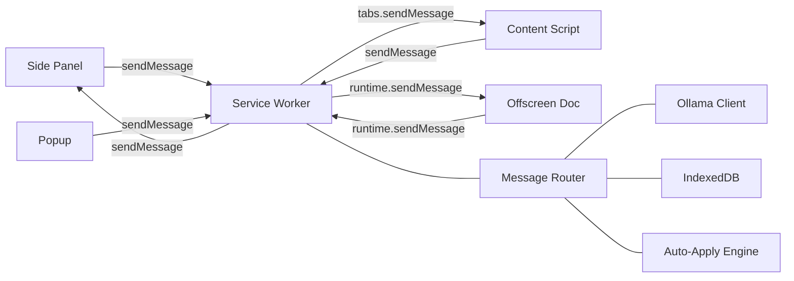

### Key Message Types

| Category | Messages | Direction |
|----------|----------|-----------|
| **Page Analysis** | `ANALYZE_PAGE`, `PAGE_ANALYSIS_RESULT`, `GET_PAGE_DATA` | CS ↔ SW |
| **Autofill** | `START_AUTOFILL`, `FILL_RESULT`, `AUTOFILL_COMPLETE` | SP → SW → CS |
| **AI** | `AI_FILL_FIELD`, `AI_ANSWER_QUESTION`, `GENERATE_COVER_LETTER` | SP/CS → SW |
| **Auto-Apply** | `START_AUTO_APPLY_LOOP`, `STOP_AUTO_APPLY_LOOP` | SP → SW |
| **LinkedIn** | `SCRAPE_JOB_CARDS`, `CLICK_JOB_CARD`, `CLICK_EASY_APPLY`, `CLICK_MODAL_BUTTON` | SW → CS |
| **RAG** | `SAVE_FILL_TO_RAG` | CS → SW |
| **Storage** | `GET_SETTINGS`, `SAVE_SETTINGS`, `GET_PROFILE`, `GET_ALL_PROFILES` | SP → SW |
| **Resume** | `UPLOAD_RESUME`, `GET_RESUME_FILE`, `PARSE_RESUME_FILE` | SP → SW → OS |

---

## 4. Content Script — ATS Detection & Autofill

### 4.1 Detection Flow

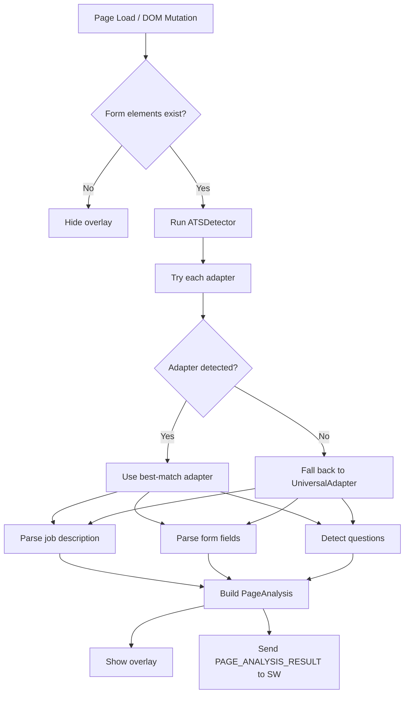

### 4.2 Adapter Pattern

```
BaseATSAdapter (abstract)
  ├── LinkedInAdapter
  ├── GreenhouseAdapter
  ├── LeverAdapter
  ├── WorkdayAdapter
  ├── IndeedAdapter
  ├── AshbyAdapter
  ├── BambooHRAdapter
  └── UniversalAdapter (fallback — works on any page)
```

Each adapter implements:
- `detect(doc)` → confidence score + page type
- `parseJobDescription(doc)` → title, company, requirements
- `parseFormFields(doc)` → `FormField[]` with element references
- `detectQuestions(doc)` → `ApplicationQuestion[]`

### 4.3 Autofill Flow

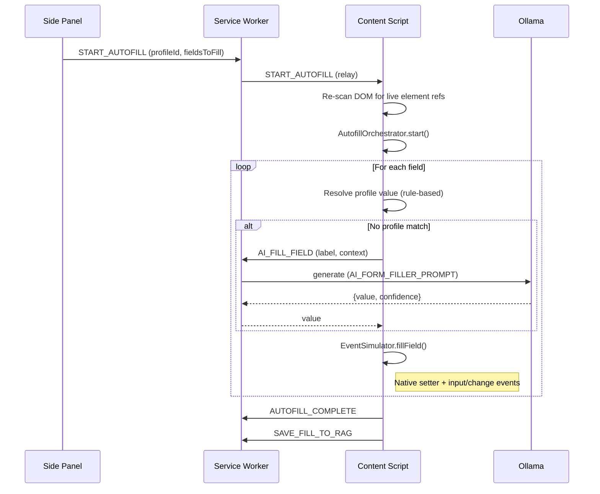

### 4.4 Event Simulator — React Compatibility

The `EventSimulator` uses `Object.getOwnPropertyDescriptor(prototype, 'value')?.set` to bypass React's synthetic event system. This is critical because React-controlled inputs ignore direct `element.value` assignments.

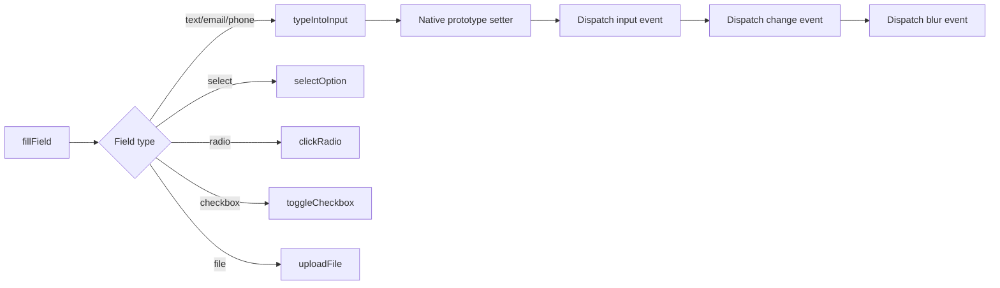

---

## 5. RAG Pipeline — Deep Dive

The RAG system gives the AI context from your resume and past application answers, making generated responses personalized and grounded.

### 5.1 RAG Architecture

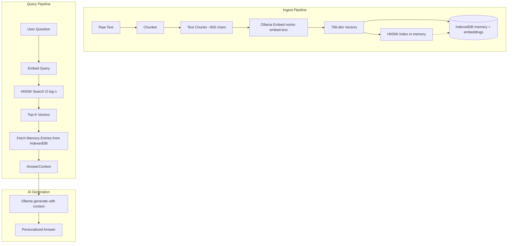

### 5.2 Chunking Strategy

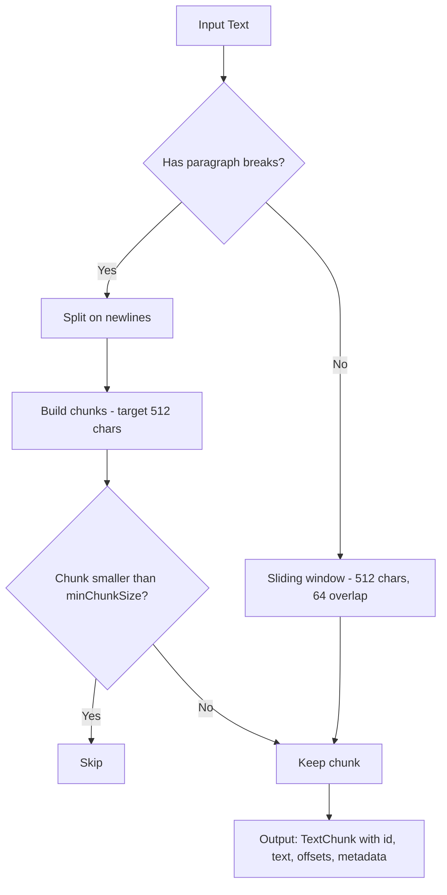

**Resume-specific chunking** (`chunkResume`): First splits on section headers (Experience, Education, Skills, etc.), then applies paragraph-aware chunking within each section. This preserves semantic boundaries.

### 5.3 Embedding Pipeline

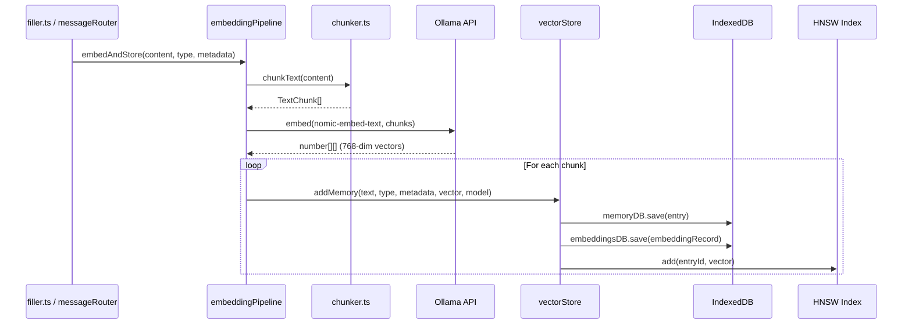

### 5.4 HNSW Index — How It Works

HNSW (Hierarchical Navigable Small World) builds a multi-layer graph where:
- **Layer 0** contains all vectors with dense connections
- **Higher layers** contain subsets with sparse connections (highway network)
- **Search** starts at the top layer and greedily descends, narrowing the search space

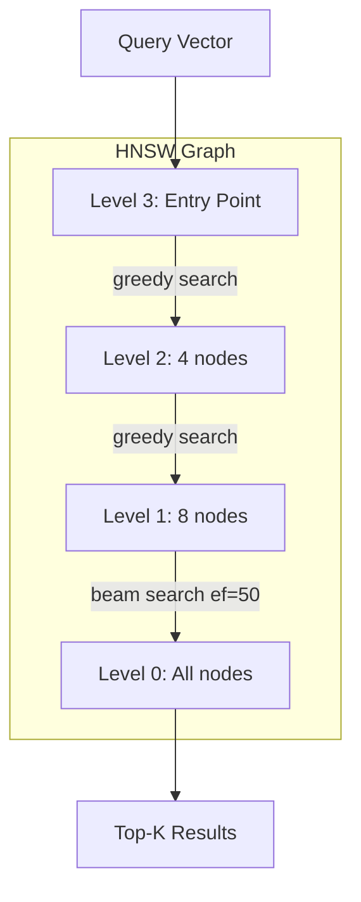

**Parameters:**
- `M = 16` — max connections per node (balances accuracy vs memory)
- `efConstruction = 100` — candidate list size during insertion
- `ef = max(topK * 3, 50)` — candidate list size during search

**Performance:** For 1000 vectors of 768 dimensions, HNSW visits ~50-100 nodes vs flat scan's 1000, giving ~10-20x speedup with >95% recall.

### 5.5 Vector Store Schema

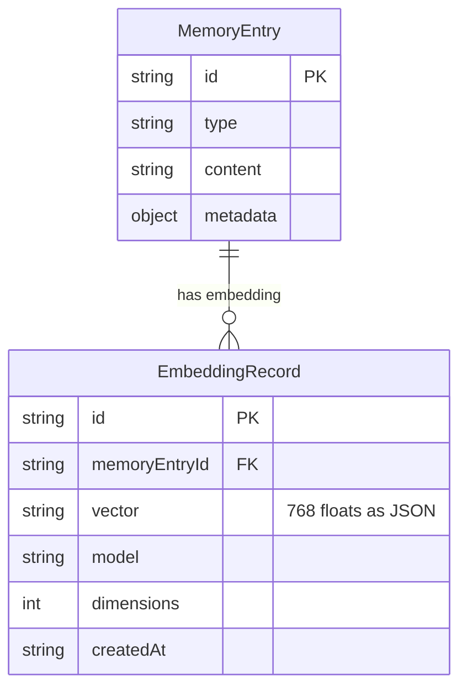

### 5.6 RAG Query Flow

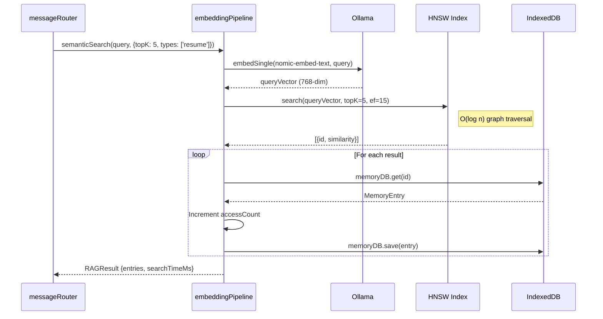

### 5.7 Memory Types

| Type | Content | When Indexed |
|------|---------|-------------|
| `resume` | Resume text chunks by section | On resume upload/parse |
| `application_answer` | Q&A pairs from past applications | After each autofill |
| `job_description` | Job posting text | On job analysis |
| `cover_letter` | Generated cover letters | On cover letter generation |
| `company_info` | Company research | On company analysis |
| `user_preference` | User settings/preferences | On preference save |
| `interview_question` | Interview Q&A | On interview prep |
| `application_note` | User notes about applications | On note save |
| `custom` | Any other text | On demand |

---

## 6. Auto-Apply Engine

### 6.1 State Machine

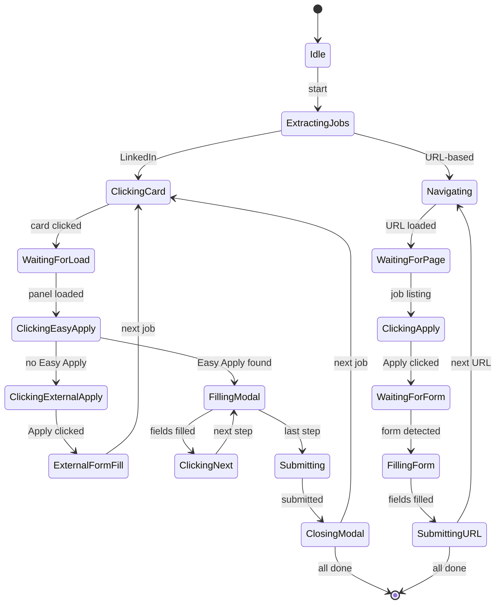

### 6.2 LinkedIn Auto-Apply Flow

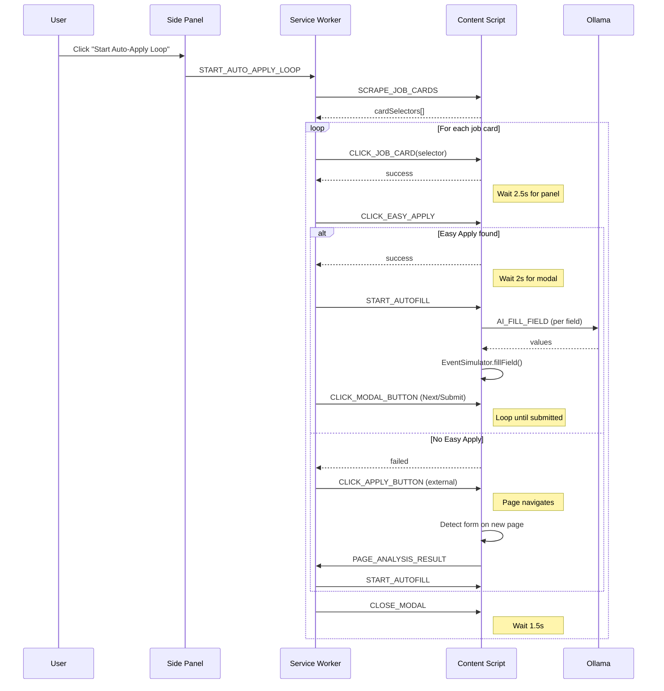

---

## 7. Storage Layer

### 7.1 IndexedDB Schema

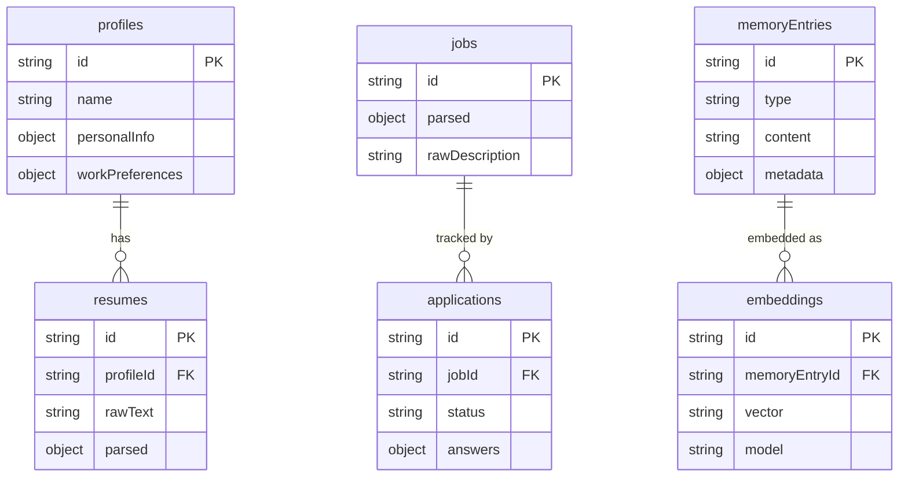

### 7.2 chrome.storage

| Area | Keys | Purpose |
|------|------|---------|
| `local` | `localapply_settings` | Extension settings (AI model, Ollama URL, defaults) |
| `session` | `ollama_status`, `tab_analysis_*`, `deferredAutofill` | Temporary session data |

---

## 8. AI Layer

### 8.1 Ollama Client

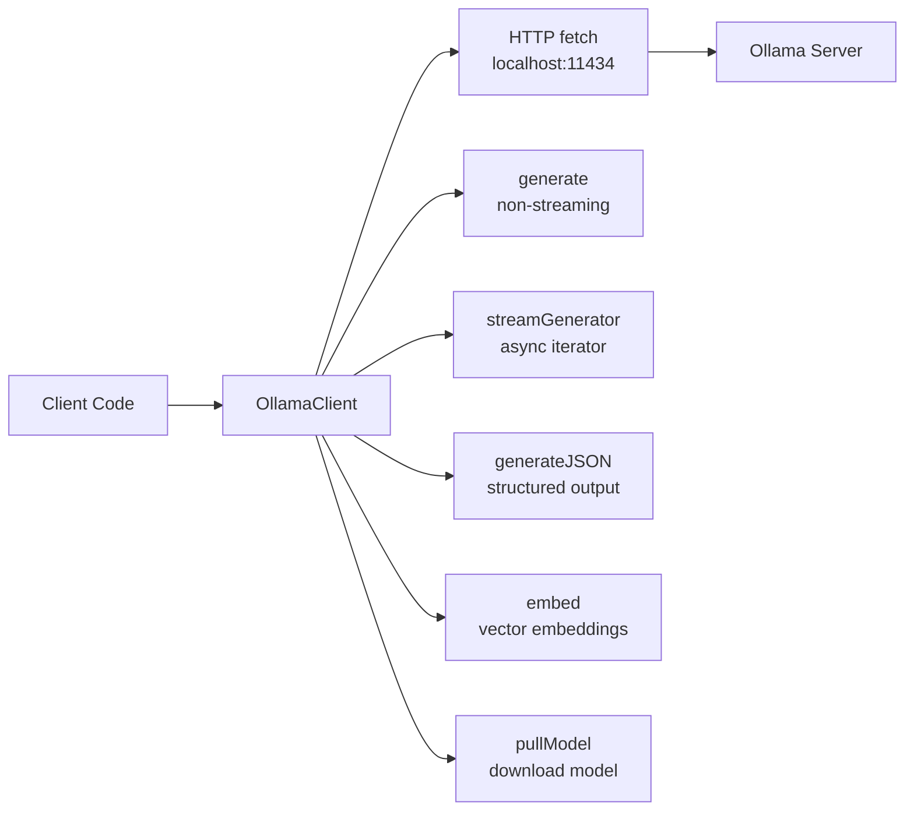

### 8.2 Prompt System

All prompts are defined in `src/ai/prompts/index.ts` as `AIPrompt` objects:

```typescript
interface AIPrompt {
  id: string;
  task: AITask;
  systemPrompt: string;
  userPromptTemplate: string;  // {{variable}} interpolation
  temperature: number;
  maxTokens: number;
  version: number;
}
```

| Prompt | Task | Temp | Used For |
|--------|------|------|----------|
| `RESUME_PARSER_PROMPT` | `resume_parse` | 0.1 | Extracting structured data from raw resume text |
| `AI_FORM_FILLER_PROMPT` | `form_fill` | 0.3 | Generating values for form fields |
| `AI_QUESTION_ANSWERER_V2_PROMPT` | `question_answer_v2` | 0.65 | Answering application questions |
| `COVER_LETTER_PROMPT` | `cover_letter` | 0.75 | Generating tailored cover letters |
| `JOB_MATCHER_PROMPT` | `job_match` | 0.2 | Calculating resume-job match score |

### 8.3 AI + RAG Integration

```mermaid
flowchart TD
    A[Form field label: "Tell us about your leadership experience"] --> B{Has profile mapping?}
    B -->|Yes| C[Resolve from profile<br/>contact.firstName, experience.*, etc.]
    B -->|No| D[AI Fill Field]

    D --> E[Check RAG for similar past answers]
    E --> F{Found similar?}
    F -->|Yes| G[Include as context in prompt]
    F -->|No| H[Use profile summary only]

    G --> I[Ollama generate<br/>AI_FORM_FILLER_PROMPT]
    H --> I
    I --> J[Return value]
    J --> K[Save to RAG<br/>for future reference]
```

---

## 9. Data Flow — End to End

### 9.1 Resume Upload → RAG Index

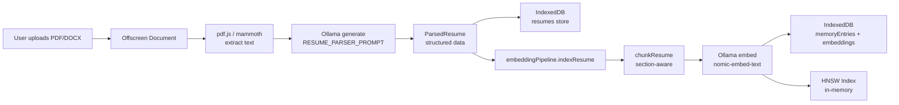

### 9.2 Job Application — Full Loop

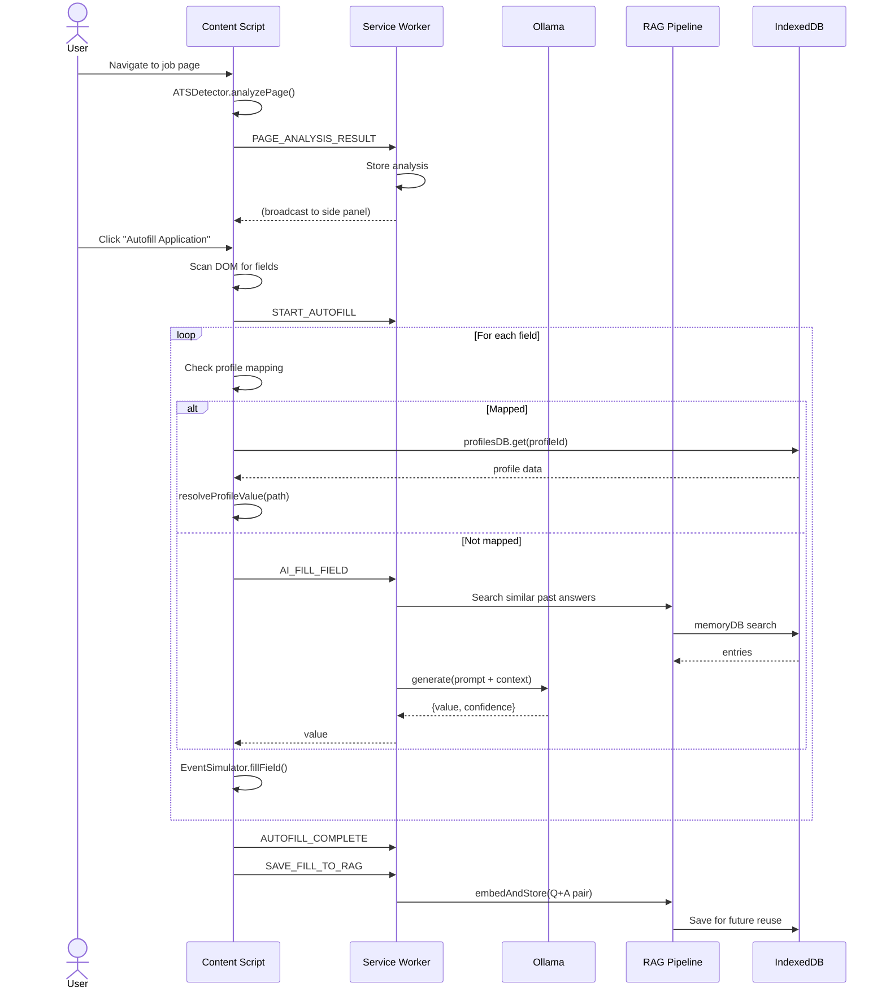

---

## 10. File Structure

```
src/
├── background/
│   ├── serviceWorker.ts        # Entry point, lifecycle, alarms
│   ├── messageRouter.ts        # Central message dispatcher
│   ├── autoApplyEngine.ts      # Auto-apply state machine
│   └── resumeParser.ts         # Offscreen document orchestrator
├── content/
│   ├── index.ts                # Content script entry, message handlers
│   ├── detector.ts             # ATS detection via adapter pattern
│   ├── overlay.ts              # Floating UI overlay
│   ├── adapters/
│   │   ├── base.ts             # BaseATSAdapter (abstract)
│   │   ├── linkedin.ts         # LinkedIn-specific
│   │   ├── greenhouse.ts       # Greenhouse + 5 more adapters
│   │   └── universal.ts        # Re-export fallback
│   └── formEngine/
│       ├── filler.ts           # Autofill orchestrator
│       └── eventSimulator.ts   # React-compatible DOM events
├── rag/
│   ├── chunker.ts              # Text splitting (paragraph-aware)
│   ├── embeddingPipeline.ts    # Chunk → embed → store → search
│   ├── vectorStore.ts          # HNSW + IndexedDB persistence
│   └── hnsw.ts                 # HNSW graph index (pure TS)
├── ai/
│   ├── ollama/
│   │   └── client.ts           # Ollama REST API client
│   └── prompts/
│       └── index.ts            # 12 prompt templates
├── storage/
│   ├── indexedDB.ts            # 8-store typed IDB layer
│   └── chromeStorage.ts        # Settings, session, badge
├── sidepanel/
│   ├── App.tsx                 # 6-tab React UI
│   └── components/
│       └── AnswerReviewPanel.tsx
├── popup/
│   └── App.tsx                 # Quick job search
├── options/
│   ├── App.tsx                 # Settings, profile, import/export
│   ├── ProfileManager.tsx      # Profile CRUD
│   └── AutomationDashboard.tsx # Auto-apply status
├── offscreen/
│   ├── index.ts                # Message handler
│   ├── pdfParser.ts            # pdf.js wrapper
│   └── docxParser.ts           # mammoth wrapper
├── types/
│   ├── messages.ts             # MessageType union, PageAnalysis
│   ├── ai.ts                   # AIPrompt, MemoryEntry, RAGQuery
│   ├── adapter.ts              # ATSAdapter interface, FormField
│   ├── settings.ts             # ExtensionSettings
│   ├── resume.ts               # CandidateProfile, ParsedResume
│   ├── job.ts                  # Job, Application
│   └── storage.ts              # IDB schema types
├── utils/
│   └── shared.ts               # sleep, randomBetween, sendToContentScript
└── styles/
    └── global.css              # Design system (dark + light themes)
```

---

## 11. Key Design Decisions

| Decision | Rationale |
|----------|-----------|
| **Ollama (local LLM)** | Privacy-first — no data leaves the machine |
| **nomic-embed-text** | Lightweight 768-dim embedding model, fast on CPU |
| **HNSW over flat scan** | O(log n) search for thousands of vectors |
| **IndexedDB over chrome.storage** | Structured data, indexes, larger quota (unlimited vs 10MB) |
| **Native value setters** | React-controlled inputs ignore direct `element.value` assignment |
| **Deferred autofill flag** | Enables cross-page apply flows (click Apply → login → autofill) |
| **Adapter pattern for ATS** | Extensible — add new ATS support by implementing `ATSAdapter` |
| **Message passing over direct calls** | Required by MV3 — service worker and content scripts are isolated |

---

## 12. Privacy Model

```
┌─────────────────────────────────────────────┐
│              Your Machine Only               │
│                                              │
│  Resume data ──► IndexedDB (local)           │
│  Profile ──► IndexedDB (local)               │
│  Application answers ──► RAG memory (local)  │
│  AI inference ──► Ollama (localhost:11434)    │
│  Embeddings ──► HNSW index (in-memory)       │
│                                              │
│  ✗ No telemetry                              │
│  ✗ No external API calls                     │
│  ✗ No cloud storage                          │
│  ✗ No analytics                              │
└─────────────────────────────────────────────┘
```
