# LocalApply — Open-Source Local AI Job Application Copilot

## Complete Engineering Design Document

---

## Executive Summary

**LocalApply** is an open-source Chrome Extension that provides AI-assisted job applications powered entirely by **Ollama** running locally on the user's machine. Unlike existing commercial products (JobCopilot, Simplify, FastApply) that depend on cloud APIs and recurring subscriptions ($9–$74/month), LocalApply offers:

- **100% local AI inference** — no data leaves the user's computer
- **Zero recurring cost** — no API keys, no subscriptions, no credit systems
- **Complete privacy** — resume, answers, and job history stay on-device
- **Extensible architecture** — plugin system for ATS adapters, AI models, and prompt strategies
- **Production-quality engineering** — TypeScript, React, Manifest V3, comprehensive testing

### Value Proposition

| Aspect | Commercial Tools | LocalApply |
|---|---|---|
| AI Processing | Cloud APIs (OpenAI, etc.) | Local Ollama |
| Cost | $9–$74/month | Free forever |
| Privacy | Data sent to servers | 100% on-device |
| Customization | Limited | Full source access |
| Model Choice | Vendor-locked | Any Ollama model |
| Offline Use | No | Yes (after model download) |

---

# Phase 1 — Product Research & Core Features

## 1.1 Feature Analysis

### Feature 1: Autofill Job Applications

**What it does:** Automatically populates form fields (name, email, phone, address, work history, education) on job application pages across dozens of ATS platforms.

**How users interact:** User clicks the extension icon or a floating overlay button on a job application page. The extension scans the page, identifies form fields, and fills them with data from the user's stored profile/resume.

**Technical challenges:**
- Each ATS (Workday, Greenhouse, Lever) uses completely different DOM structures
- React/Angular-based forms require dispatching synthetic events, not just setting `.value`
- Multi-page application flows require step detection and navigation
- Dropdowns, radio buttons, checkboxes, and file uploads each need specialized handlers
- Dynamic form rendering (fields appearing after previous fields are filled)
- Shadow DOM and iframe isolation on some platforms

**Our improved implementation:**
- **AI-powered field mapping:** Instead of brittle CSS selectors, use Ollama to analyze the DOM context around each field and intelligently map it to resume data
- **Event simulation engine:** Properly dispatch `input`, `change`, `blur`, and `keydown` events with appropriate bubbling to satisfy React/Angular validation
- **MutationObserver-based step detection:** Automatically detect page transitions in multi-step forms
- **User review mode:** Always pause before submission to let users verify and edit

---

### Feature 2: AI-Generated Answers

**What it does:** When application forms include open-ended questions ("Why do you want to work here?", "Describe a challenging project"), the AI generates contextual, personalized answers.

**How users interact:** Questions are detected automatically. The extension displays a panel showing each question with a generated answer. Users can accept, edit, regenerate, or manually write answers.

**Technical challenges:**
- Question type classification (behavioral, technical, salary, yes/no, free-text)
- Context assembly (resume + job description + company info + prior answers)
- Answer quality and tone matching
- Handling character limits and word count constraints
- Learning from user edits to improve future answers

**Our improved implementation:**
- **RAG-enhanced answers:** Retrieve similar past answers from local memory, use them as few-shot examples
- **Question categorization pipeline:** Classify questions before generating, applying category-specific prompts
- **Tone/length controls:** User-configurable answer style (concise, detailed, professional, casual)
- **Answer versioning:** Store every generated and edited answer for continuous improvement
- **Confidence scoring:** Display a confidence score so users know when to pay extra attention

---

### Feature 3: Resume Management

**What it does:** Import, store, parse, and manage multiple resume versions. Provides structured data extraction from PDF/DOCX files.

**How users interact:** Users upload resumes through the options page or side panel. The extension parses them into structured data (skills, experience, education). Users can maintain multiple resume versions for different job targets.

**Technical challenges:**
- PDF text extraction with layout preservation
- DOCX XML parsing
- Handling multi-column resumes, tables, and inconsistent formatting
- Section identification (Experience vs. Projects vs. Volunteer Work)
- Deduplication across resume versions

**Our improved implementation:**
- **Dual-engine parsing:** PDF.js for digital PDFs + Tesseract.js (via Web Worker) for scanned/image PDFs
- **AI-powered section detection:** Use Ollama to identify and classify resume sections regardless of header naming
- **Structured JSON schema:** Normalize all resumes into a canonical schema for consistent processing
- **Resume diff view:** Visual comparison between resume versions
- **Auto-merge:** Intelligently combine data from multiple resume uploads

---

### Feature 4: Cover Letter Generation

**What it does:** Generates tailored cover letters based on the job description and user's resume, optimized for ATS compatibility.

**How users interact:** From the side panel, users select a job posting. The extension generates a cover letter draft that can be edited, regenerated with different tones/styles, and exported as PDF/DOCX.

**Technical challenges:**
- Maintaining natural, non-generic language
- Matching company culture and tone from the job description
- Avoiding repetition of resume content verbatim
- ATS keyword integration without keyword stuffing
- Multiple format export (PDF, DOCX, plain text)

**Our improved implementation:**
- **Multi-pass generation:** First extract key requirements, then match user qualifications, then compose
- **Company context injection:** Scrape the company page for mission/values to personalize
- **Style templates:** Professional, creative, startup-friendly, academic
- **A/B variant generation:** Generate 2–3 variants for the user to choose from
- **Live keyword overlay:** Highlight which job description keywords are covered

---

### Feature 5: Job Matching & Scoring

**What it does:** Analyzes a job description against the user's resume and provides a match score, identifying strengths, gaps, and improvement suggestions.

**How users interact:** When visiting a job posting, the extension shows a floating widget with match percentage, missing skills, and suggestions. Available in both the side panel and as an overlay.

**Technical challenges:**
- Semantic understanding beyond keyword matching
- Handling implicit requirements (e.g., "fast-paced environment" → adaptability)
- Accurate skill taxonomy and synonyms (React.js = ReactJS = React)
- Weighing required vs. preferred qualifications

**Our improved implementation:**
- **Embedding-based matching:** Use local embeddings to compute semantic similarity, not just keyword overlap
- **Skill taxonomy database:** Maintain a local skill ontology with synonyms and hierarchies
- **Weighted scoring:** Required skills weighted 2x over preferred; years of experience factored in
- **Actionable insights:** Specific suggestions on resume bullets to add, skills to highlight

---

### Feature 6: ATS Compatibility Analysis

**What it does:** Scans the user's resume for ATS readability issues and provides an optimization score.

**How users interact:** Users upload a resume and receive an ATS score with specific issues (formatting problems, missing keywords, unreadable sections) and fix suggestions.

**Technical challenges:**
- Simulating ATS parsing behavior (no standard exists)
- Detecting problematic formatting (tables, headers, footers, images)
- Keyword density analysis without overfitting
- Providing actionable, specific fixes

**Our improved implementation:**
- **Multi-factor scoring:** Format score + keyword score + structure score + readability score
- **Side-by-side view:** Show "what the ATS sees" vs. the original formatting
- **One-click fixes:** Auto-apply formatting corrections where possible
- **Industry benchmarks:** Compare scores against successful applications in similar roles

---

### Feature 7: Multi-Step Application Handling

**What it does:** Navigates multi-page application forms (common on Workday, iCIMS), maintaining state across pages and handling form validation.

**Technical challenges:**
- Detecting page transitions (URL change, DOM mutation, AJAX load)
- Maintaining form state across pages
- Handling back-navigation without data loss
- Validation error detection and recovery
- Timeout and session expiry handling

**Our improved implementation:**
- **State machine architecture:** Model each ATS as a finite state machine with known page transitions
- **Progress persistence:** Save partial application state to IndexedDB so users can resume
- **Validation watcher:** Monitor DOM for error messages and auto-correct or prompt user
- **Session keepalive:** Periodic activity to prevent session timeouts

---

### Feature 8: Job Tracking Dashboard

**What it does:** Tracks all applications (submitted, in-progress, rejected, interview-scheduled) with notes, dates, and documents used.

**How users interact:** A dashboard in the side panel or popup showing application pipeline, filterable by status, company, date. Exportable as CSV.

**Our improved implementation:**
- **Auto-capture:** Automatically log applications when submitted through the extension
- **Kanban board view:** Visual pipeline (Applied → Screened → Interview → Offer → Rejected)
- **Analytics:** Application rate, response rate, time-to-response charts
- **Company notes:** Attach notes about company culture, interview tips, contact info
- **Export/import:** JSON and CSV export for portability

---

### Feature 9: Profile Management

**What it does:** Store and manage user profile data (personal info, work preferences, standard answers to screening questions).

**Our improved implementation:**
- **Multi-profile support:** Different profiles for different job targets (e.g., "Frontend Dev" vs. "Full Stack")
- **Screening answer library:** Pre-configured answers for common questions (work authorization, salary, notice period)
- **Auto-sync:** When resume is updated, offer to sync profile fields
- **Privacy controls:** Granular control over what data is used for autofill

---

### Feature 10: Smart Field Detection

**What it does:** Intelligently identifies form fields on job application pages regardless of the ATS platform.

**Our improved implementation:**
- **Hybrid detection:** Combine label/placeholder text matching, ARIA attributes, DOM structure analysis, and LLM-based field classification
- **Confidence scoring:** Each field match gets a confidence score; low-confidence fields are highlighted for user review
- **Learning system:** When users correct a field mapping, store the correction for future use on that ATS

---

### Feature 11: Resume Tailoring

**What it does:** Automatically modifies resume bullet points and skills to better match a specific job description.

**Our improved implementation:**
- **Bullet-level optimization:** Rewrite individual bullets to emphasize relevant keywords without fabricating experience
- **Skills reordering:** Automatically prioritize skills that match the job description
- **Before/after diff:** Show exactly what changed and why
- **Integrity guard:** AI prompt explicitly instructs "never add experience or skills the candidate doesn't have"

---

### Feature 12: Application History & Memory

**What it does:** Maintains a searchable history of all applications, answers given, and documents used.

**Our improved implementation:**
- **Full-text search:** Search across all past applications, answers, and job descriptions
- **Answer reuse:** When a similar question appears, suggest previous answers
- **Pattern detection:** Identify which types of applications get responses
- **Data export:** Complete export of all data for portability

---

# Phase 2 — Competitive Analysis

## 2.1 Detailed Comparison Matrix

| Feature | JobCopilot | Simplify Copilot | JobWizard | AIApply | FastApply | **LocalApply (Ours)** |
|---|---|---|---|---|---|---|
| **Supported ATS** | 500K+ career pages | Workday, Greenhouse, Lever, iCIMS, 1000+ | Workday, Greenhouse, Lever, iCIMS, Taleo, Ashby, SmartRecruiters | Custom aggregator | Indeed, Glassdoor, Workday, Greenhouse, Lever, Ashby, ZipRecruiter (10+) | LinkedIn, Indeed, Greenhouse, Lever, Workday, Ashby, BambooHR, SmartRecruiters, Jobvite, Wellfound |
| **AI Capabilities** | Resume builder, cover letter, mock interview, salary negotiation | Resume tailoring, cover letter, keyword analysis | Cover letter, ATS optimizer, custom question answering | Resume/cover letter builder, interview buddy, real-time coaching | Resume tailoring, cover letter, question answering | Full local AI: resume parsing, tailoring, cover letters, job matching, question answering, ATS optimization, RAG memory |
| **Autofill Quality** | Good (review mode recommended) | Excellent (one-click across many ATS) | Good (handles multi-page, dropdowns) | Moderate (targeting accuracy issues reported) | Good (4 modes: Copilot, Autonomous, Stealth, Swipe) | AI-powered field mapping with confidence scores, event simulation engine |
| **Resume Customization** | Basic AI builder | Keyword analyzer + tailoring | ATS optimizer with match scores | ATS-optimized generator | Per-job resume rewriting | Bullet-level tailoring with integrity guard, diff view, multi-version management |
| **Cover Letter Generation** | Included | AI-generated, tailored | ATS-optimized, tailored to JD | AI-generated | Per-job custom generation | Multi-pass with company context, style templates, A/B variants |
| **Browser Automation** | Auto-apply + review mode | One-click autofill | Autofill with review | Auto-apply with credits | 4 modes (Copilot to Stealth) | AI-driven form detection, human-in-the-loop review, state machine navigation |
| **Privacy** | ⚠️ Data sent to cloud | ⚠️ Data sent to cloud | ⚠️ Data sent to cloud | ⚠️ Data sent to cloud | ⚠️ Data sent to cloud | ✅ **100% local — zero data transmission** |
| **Cloud Dependency** | Full cloud | Full cloud | Full cloud | Full cloud | Full cloud | **None** — fully offline after model download |
| **Local AI Support** | ❌ None | ❌ None | ❌ None | ❌ None | ❌ None | ✅ **Core design principle** — Ollama-powered |
| **Pricing Model** | $8.90–$12.90/week | Freemium (Simplify+ for premium) | Freemium (daily quota) | $23–$74/month | $14/month (5 free credits) | **Free and open-source forever** |
| **Strengths** | Large ATS coverage, verified sources, all-in-one suite | Clean UX, strong autofill, keyword analyzer, free tier | LinkedIn referral finder, broad ATS support, free tier | Comprehensive career suite, interview prep | Innovative modes (Swipe, Stealth), fast automation | Privacy-first, free, extensible, customizable AI, offline-capable |
| **Weaknesses** | Expensive, mixed quality reviews, billing complaints | Premium features paywalled, cloud-dependent | Limited differentiation, cloud-dependent | Complex pricing, targeting accuracy issues | Cloud-dependent, potential for spam applications | Requires Ollama installation, local compute resources, initial model download |
| **Worth Implementing** | Review mode, ATS verification, application limits | One-click autofill, keyword analyzer, job tracker | LinkedIn referral concepts, multi-ATS support | Interview prep concepts, application dashboard | Copilot vs. Autonomous modes, swipe interface | — |

## 2.2 Key Competitive Insights

> [!IMPORTANT]
> **Every single competitor is cloud-dependent.** This is our primary differentiator. No existing tool offers local AI inference, making LocalApply the first privacy-first job application copilot.

### Patterns Worth Adopting
1. **Review-before-submit** (universal pattern across all competitors)
2. **Keyword analysis** from Simplify — visual gap analysis between resume and JD
3. **Multiple automation modes** from FastApply — let users choose their comfort level
4. **Application tracking dashboard** — every competitor has this, users expect it
5. **Screening answer library** — pre-store answers to common questions

### Patterns to Avoid
1. **Fully autonomous "stealth" mode** — risks account bans and spam
2. **Credit-based pricing** — antithetical to open-source
3. **Aggressive auto-submission** without review — quality over quantity

---

# Phase 3 — MVP Definition

## 3.1 MVP (Minimum Viable Product)
*Goal: Smallest useful product that demonstrates local AI value*

| Feature | Description | Priority |
|---|---|---|
| Ollama connection | Connect to local Ollama, verify model availability, stream responses | P0 |
| Profile setup | Basic profile form (name, email, phone, address, work preferences) | P0 |
| Resume import (PDF) | Upload and parse PDF resumes into structured JSON | P0 |
| Job description extraction | Extract JD text from current page | P0 |
| Job matching score | Compare resume vs. JD, show match % and gaps | P0 |
| Basic autofill | Fill standard form fields (name, email, phone) on 2–3 ATS | P0 |
| Side panel UI | Primary interface for all extension interactions | P0 |
| Local storage | Persist profile and resume data via chrome.storage + IndexedDB | P0 |

## 3.2 Version 1.0 (Production-Ready)
*Goal: Full-featured release competitive with commercial tools*

| Feature | Description |
|---|---|
| Multi-ATS autofill | LinkedIn, Indeed, Greenhouse, Lever, Workday adapters |
| AI question answering | Detect and answer application questions with RAG context |
| Cover letter generation | Generate tailored cover letters with style options |
| Resume tailoring | Bullet-level resume optimization for specific JDs |
| ATS scoring | Multi-factor ATS compatibility analysis |
| Application tracker | Kanban board with auto-capture |
| Screening answer library | Pre-configured answers for common screening questions |
| Multi-profile support | Different profiles for different job targets |
| Settings page | Model selection, Ollama configuration, privacy controls |

## 3.3 Version 2.0 (Advanced AI)
*Goal: AI capabilities that exceed commercial tools*

| Feature | Description |
|---|---|
| Full RAG pipeline | Local vector database with answer memory and learning |
| Company intelligence | Auto-research companies from their websites |
| Interview prep | Generate likely interview questions based on JD |
| Salary analysis | Analyze salary data for negotiation context |
| Application analytics | Success rate analysis, pattern detection |
| LinkedIn referral helper | Identify and draft connection requests |
| Resume builder | Full resume creation from scratch with AI |
| Browser automation modes | Copilot + semi-autonomous modes |

## 3.4 Future (Experimental)
*Goal: Cutting-edge features for exploration*

| Feature | Description |
|---|---|
| In-browser LLM | Run small models directly via WebGPU (no Ollama needed) |
| Voice interview prep | Speech-to-text mock interviews |
| Plugin marketplace | Community-built ATS adapters and prompt packs |
| Team mode | Shared configurations for career coaches |
| Remote AI providers | Optional cloud AI backend for users without local GPU |
| Multi-browser | Firefox and Edge support |

---

# Phase 4 — System Architecture

## 4.1 High-Level Architecture

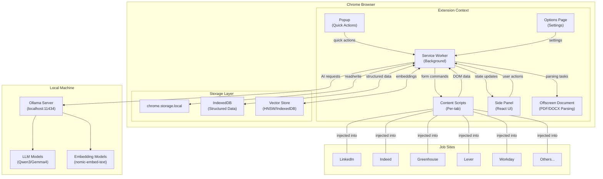

## 4.2 Component Architecture

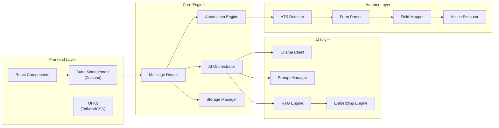

## 4.3 Data Flow Architecture

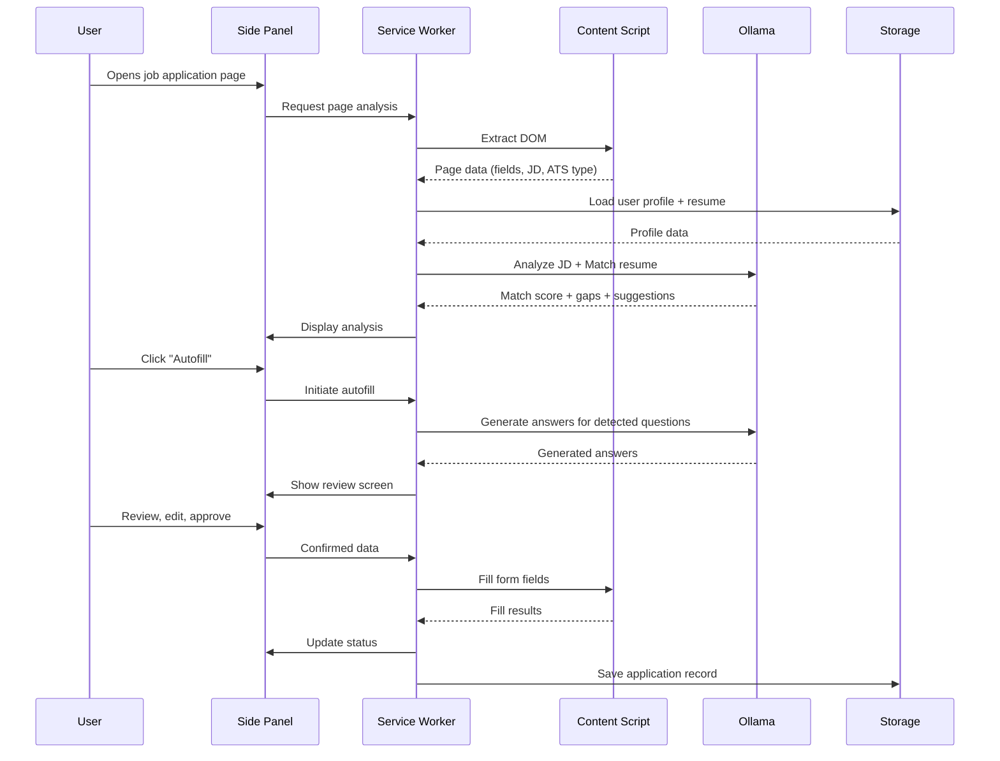

## 4.4 Technology Stack

### Frontend
| Technology | Purpose | Justification |
|---|---|---|
| **React 19** | UI framework | Component model, ecosystem, developer experience |
| **TypeScript 5.x** | Type safety | Catch errors at compile time, better DX across message passing |
| **TailwindCSS 4** | Styling | Rapid prototyping, consistent design, small bundle with purging |
| **Zustand** | State management | Lightweight, TypeScript-native, no boilerplate |
| **Vite** | Build tool | Fast HMR, optimized builds, excellent plugin ecosystem |

### Chrome Extension
| API | Purpose |
|---|---|
| **Manifest V3** | Modern extension platform |
| **Service Worker** | Background coordination, AI orchestration, message routing |
| **Content Scripts** | DOM interaction, form filling, page parsing |
| **Side Panel** | Primary persistent UI |
| **Popup** | Quick actions (start autofill, view score) |
| **Options Page** | Settings, model configuration, data management |
| **Offscreen Document** | PDF/DOCX parsing (requires DOM APIs unavailable in Service Worker) |
| **chrome.storage.local** | Settings, profile data, small structured data |
| **chrome.storage.session** | Temporary session state |

### Storage
| Technology | Purpose | Data Type |
|---|---|---|
| **chrome.storage.local** | Settings, preferences, profile | Small key-value (<10MB) |
| **IndexedDB** | Resumes, applications, answers, job descriptions | Large structured data (unlimited) |
| **Custom HNSW Index** (IndexedDB-backed) | Vector embeddings for RAG | Float32 arrays |

### AI
| Technology | Purpose |
|---|---|
| **Ollama REST API** | LLM and embedding inference |
| **ollama/browser** | TypeScript client with streaming support |
| **Custom prompt library** | Task-specific optimized prompts |
| **HNSW-WASM** | In-extension vector similarity search |

### Parsing
| Library | Purpose |
|---|---|
| **PDF.js** | PDF text extraction |
| **Tesseract.js** | OCR for scanned PDFs (Web Worker) |
| **mammoth.js** | DOCX to HTML/text conversion |

---

# Phase 5 — Ollama AI Layer

## 5.1 Model Recommendations

### Generative Models (LLM)

| Model | Params | Quant | RAM (CPU) | VRAM (GPU) | CPU Speed | GPU Speed | Output Quality | JSON Reliability | Best Use Case |
|---|---|---|---|---|---|---|---|---|---|
| **Qwen3 4B** | 4B | Q4_K_M | ~3.5 GB | ~3 GB | ~15 tok/s | ~45 tok/s | Good | Very Good | Quick tasks, resource-constrained systems |
| **Qwen3 8B** | 8B | Q4_K_M | ~6 GB | ~5.5 GB | ~10 tok/s | ~35 tok/s | Very Good | Excellent | **⭐ Recommended Default** — best balance |
| **Qwen3 14B** | 14B | Q4_K_M | ~10 GB | ~9 GB | ~6 tok/s | ~25 tok/s | Excellent | Excellent | Complex reasoning, detailed cover letters |
| **Qwen3 30B** | 30B | Q4_K_M | ~20 GB | ~18 GB | ~3 tok/s | ~15 tok/s | Outstanding | Excellent | Users with 24GB+ VRAM |
| **Gemma 4 12B** | 12B | Q4_K_M | ~8 GB | ~7.5 GB | ~8 tok/s | ~30 tok/s | Excellent | Excellent | Strong alternative to Qwen3 8B |
| **Gemma 4 27B** | 27B | Q4_K_M | ~18 GB | ~16 GB | ~4 tok/s | ~18 tok/s | Outstanding | Excellent | High-VRAM users wanting Google's architecture |
| **Llama 4 Scout** | 17B active / 109B total (MoE) | Q4_K_M | ~70 GB | ~65 GB | ~2 tok/s | ~12 tok/s | Outstanding | Very Good | Users with 48GB+ VRAM, long context |
| **Phi-4 Mini** | 3.8B | Q4_K_M | ~3 GB | ~2.5 GB | ~20 tok/s | ~55 tok/s | Good | Good | Fastest option, edge/low-end hardware |
| **Phi-4 14B** | 14B | Q4_K_M | ~10 GB | ~9 GB | ~6 tok/s | ~25 tok/s | Very Good | Very Good | Strong reasoning at medium size |
| **DeepSeek R1 7B** | 7B | Q4_K_M | ~5.5 GB | ~4.5 GB | ~12 tok/s | ~40 tok/s | Very Good | Good | Reasoning-heavy tasks, math |
| **Mistral 7B** | 7B | Q4_K_M | ~5.5 GB | ~4.5 GB | ~12 tok/s | ~40 tok/s | Good | Good | General purpose fallback |

> [!TIP]
> **Speed estimates** are approximate for modern consumer hardware (RTX 4060–4090 for GPU, Ryzen 7/i7 for CPU). Actual speeds vary by hardware, context length, and quantization level.

### Embedding Models

| Model | Dimensions | Context | Size | Speed | Quality | Use Case |
|---|---|---|---|---|---|---|
| **nomic-embed-text** | 768 | 8192 tokens | ~274 MB | Fast | Very Good | **⭐ Recommended Default** — best balance for RAG |
| **Qwen3-Embedding** | Adjustable | 32K tokens | ~600 MB | Moderate | Excellent | Multilingual, very long documents |
| **all-minilm** | 384 | 512 tokens | ~45 MB | Very Fast | Adequate | Legacy, resource-constrained only |
| **bge-m3** | 1024 | 8192 tokens | ~1.2 GB | Moderate | Excellent | Multilingual, hybrid retrieval |
| **mxbai-embed-large** | 1024 | 512 tokens | ~670 MB | Moderate | Very Good | High-quality dense embeddings |

### Task-to-Model Mapping

| Task | Primary Model | Fallback Model | Why |
|---|---|---|---|
| Resume parsing | Qwen3 8B | Gemma 4 12B | Best structured JSON output |
| Resume tailoring | Qwen3 8B | Qwen3 14B | Needs good writing + JSON |
| Cover letter generation | Qwen3 14B | Qwen3 8B | Benefits from larger model for writing quality |
| Job matching | Qwen3 8B + nomic-embed-text | Gemma 4 12B | Semantic matching + scoring |
| Question answering | Qwen3 8B | Qwen3 14B | Contextual, personalized responses |
| Skill extraction | Qwen3 8B | Phi-4 14B | Structured extraction task |
| ATS optimization | Qwen3 8B | Qwen3 14B | Keyword analysis + rewriting |
| Summarization | Phi-4 Mini | Qwen3 4B | Speed critical, quality acceptable |
| JSON generation | Qwen3 8B | Qwen3 14B | Native structured output support |
| Embeddings | nomic-embed-text | bge-m3 | Best local RAG performance |

### ⭐ Default Recommended Configuration

```
Primary LLM:     qwen3:8b       (~6 GB RAM, ~5.5 GB VRAM)
Embedding Model:  nomic-embed-text (~274 MB)
Total Minimum:    ~6.3 GB RAM (CPU mode) or ~5.8 GB VRAM (GPU mode)
```

**Why Qwen3 8B?**
- Best-in-class instruction following at the 8B parameter tier
- Excellent native structured output / JSON reliability with Ollama's `format` parameter
- Good multilingual support for international job seekers
- Runs comfortably on 16GB RAM (CPU) or 8GB+ VRAM (GPU)
- Strong balance of speed (~35 tok/s GPU) and quality

## 5.2 Ollama Integration Architecture

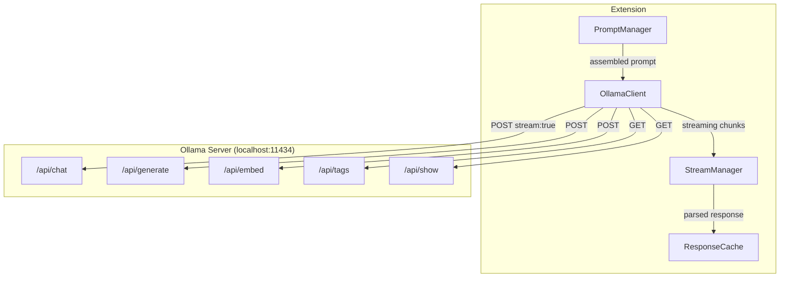

### Connection Management

```typescript
// Ollama health check and model verification
interface OllamaConfig {
  baseUrl: string;          // default: 'http://localhost:11434'
  primaryModel: string;     // default: 'qwen3:8b'
  embeddingModel: string;   // default: 'nomic-embed-text'
  timeout: number;          // default: 120000 (2 minutes)
  maxRetries: number;       // default: 3
  temperature: number;      // default: 0.7
  contextLength: number;    // default: 4096
}
```

### CORS Configuration

The extension requires Ollama to allow cross-origin requests:

**Windows:** `setx OLLAMA_ORIGINS "chrome-extension://*" /M`
**macOS/Linux:** `export OLLAMA_ORIGINS="chrome-extension://*"`

**Manifest permissions:**
```json
{
  "host_permissions": ["http://localhost:11434/*", "http://127.0.0.1:11434/*"]
}
```

---

# Phase 6 — Resume Intelligence Engine

## 6.1 Architecture

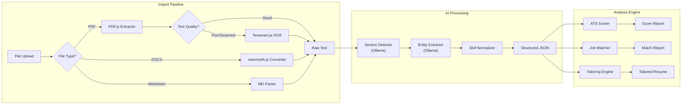

## 6.2 Resume JSON Schema

```typescript
interface ParsedResume {
  id: string;
  version: number;
  createdAt: string;
  updatedAt: string;
  rawText: string;
  source: 'pdf' | 'docx' | 'markdown' | 'manual';
  
  contact: {
    fullName: string;
    firstName: string;
    lastName: string;
    email: string;
    phone: string;
    location: {
      city: string;
      state: string;
      country: string;
      zipCode: string;
    };
    linkedin?: string;
    github?: string;
    portfolio?: string;
  };

  summary?: string;
  objectiveStatement?: string;

  experience: WorkExperience[];
  education: Education[];
  skills: SkillCategory[];
  certifications: Certification[];
  projects: Project[];
  awards: Award[];
  publications: Publication[];
  languages: Language[];
  volunteerWork: VolunteerExperience[];

  metadata: {
    totalYearsExperience: number;
    highestEducation: string;
    primaryIndustry: string;
    seniorityLevel: 'entry' | 'mid' | 'senior' | 'lead' | 'executive';
    atsScore: number;
    lastAnalyzed: string;
  };
}

interface WorkExperience {
  id: string;
  company: string;
  title: string;
  location?: string;
  startDate: string;
  endDate?: string;
  current: boolean;
  description: string;
  bullets: string[];
  skills: string[];
  achievements: Achievement[];
}

interface Achievement {
  description: string;
  metric?: string;
  impact?: string;
}

interface Education {
  id: string;
  institution: string;
  degree: string;
  field: string;
  gpa?: number;
  startDate: string;
  endDate?: string;
  honors?: string[];
  coursework?: string[];
}

interface SkillCategory {
  category: string; // "Programming Languages", "Frameworks", "Tools", etc.
  skills: Skill[];
}

interface Skill {
  name: string;
  level?: 'beginner' | 'intermediate' | 'advanced' | 'expert';
  yearsOfExperience?: number;
  synonyms: string[]; // ["React", "ReactJS", "React.js"]
}

interface Certification {
  name: string;
  issuer: string;
  dateObtained: string;
  expirationDate?: string;
  credentialId?: string;
}

interface Project {
  name: string;
  description: string;
  technologies: string[];
  url?: string;
  startDate?: string;
  endDate?: string;
  highlights: string[];
}

interface Award {
  title: string;
  issuer: string;
  date: string;
  description?: string;
}

interface Publication {
  title: string;
  publisher: string;
  date: string;
  url?: string;
  coAuthors?: string[];
}
```

## 6.3 Job Matching Algorithm

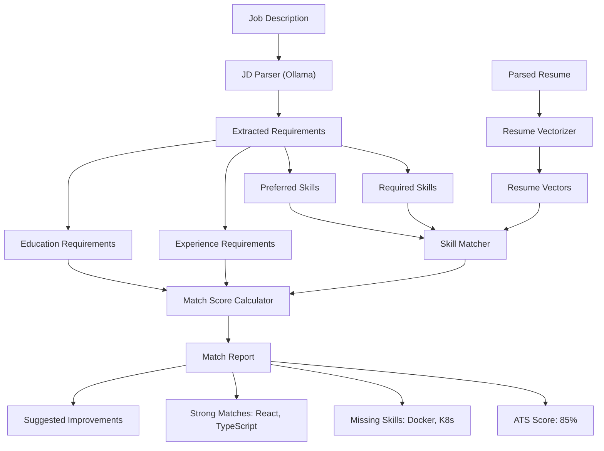

### Scoring Formula

```
Total Score = (
  Required Skills Match    × 0.35 +
  Preferred Skills Match   × 0.15 +
  Experience Match         × 0.20 +
  Education Match          × 0.10 +
  Semantic Similarity      × 0.15 +
  Keyword Coverage         × 0.05
) × 100

Where each sub-score is normalized to [0, 1]
```

---

# Phase 7 — Job Site Automation

## 7.1 Adapter Architecture

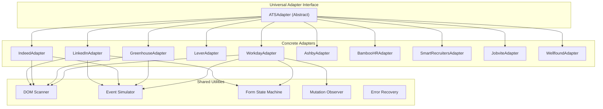

## 7.2 Adapter Interface

```typescript
interface ATSAdapter {
  // Identification
  readonly name: string;
  readonly version: string;
  readonly supportedDomains: string[];
  
  // Detection
  detect(document: Document): Promise<ATSDetectionResult>;
  
  // Parsing
  parseJobDescription(document: Document): Promise<ParsedJobDescription>;
  parseFormFields(document: Document): Promise<FormField[]>;
  detectQuestions(document: Document): Promise<ApplicationQuestion[]>;
  
  // Actions
  fillField(field: FormField, value: string): Promise<FillResult>;
  uploadFile(field: FormField, file: File): Promise<UploadResult>;
  selectOption(field: FormField, value: string): Promise<FillResult>;
  
  // Navigation
  detectCurrentStep(document: Document): Promise<ApplicationStep>;
  navigateToNextStep(document: Document): Promise<NavigationResult>;
  
  // Validation
  detectErrors(document: Document): Promise<FormError[]>;
  detectSuccess(document: Document): Promise<SubmissionResult>;
  
  // Recovery
  handleError(error: AutomationError): Promise<RecoveryAction>;
}

interface ATSDetectionResult {
  detected: boolean;
  atsName: string;
  confidence: number;
  pageType: 'job_listing' | 'application_form' | 'confirmation' | 'unknown';
  metadata: Record<string, string>;
}

interface FormField {
  id: string;
  element: HTMLElement;
  type: 'text' | 'email' | 'phone' | 'textarea' | 'select' | 'radio' | 'checkbox' | 'file' | 'date' | 'number';
  label: string;
  placeholder?: string;
  required: boolean;
  maxLength?: number;
  options?: string[];        // for select/radio
  mappedProfileField?: string; // which resume/profile field maps here
  confidence: number;         // 0-1 confidence of field mapping
  currentValue?: string;
}

interface ApplicationQuestion {
  id: string;
  text: string;
  type: 'free_text' | 'multiple_choice' | 'yes_no' | 'numeric' | 'date';
  category: QuestionCategory;
  required: boolean;
  maxLength?: number;
  options?: string[];
  suggestedAnswer?: string;
  confidence: number;
}

type QuestionCategory = 
  | 'behavioral'
  | 'salary'
  | 'technical'
  | 'availability'
  | 'visa'
  | 'relocation'
  | 'work_authorization'
  | 'education'
  | 'experience'
  | 'certifications'
  | 'cover_letter'
  | 'custom';
```

## 7.3 Per-Adapter Specifications

### LinkedIn Adapter
- **Domains:** `linkedin.com/jobs/*`
- **Key challenges:** "Easy Apply" modal overlay, multi-step flow within modal, resume upload, connection prompts
- **Detection:** Look for `jobs-apply-button`, `.jobs-easy-apply-content`
- **Form structure:** Relatively standardized but uses React with synthetic events
- **Special handling:** LinkedIn may detect automation — include human-like delays

### Indeed Adapter
- **Domains:** `indeed.com/viewjob*`, `indeed.com/applystart*`
- **Key challenges:** Mix of on-site and redirect applications, indeed-hosted forms vs. company redirect
- **Detection:** `#indeed-apply-widget`, `.ia-Apply`
- **Form structure:** Standardized for Indeed-hosted, variable for redirects

### Greenhouse Adapter
- **Domains:** `boards.greenhouse.io/*`, `*.greenhouse.io/*`, `jobs.*.com` (embedded)
- **Key challenges:** Embedded vs. standalone forms, custom questions per company
- **Detection:** `#application_form`, `data-greenhouse`
- **Form structure:** Predictable HTML, label-based field identification

### Lever Adapter
- **Domains:** `jobs.lever.co/*`, `*.lever.co/*`
- **Key challenges:** Clean but limited form structure, custom questions
- **Detection:** `.posting-page`, `#lever-jobs-iframe`
- **Form structure:** Semantic HTML, good accessibility labels

### Workday Adapter
- **Domains:** `*.myworkdayjobs.com/*`, `*.wd5.myworkdayjobs.com/*`
- **Key challenges:** **Most complex ATS** — multi-page wizard, dynamic rendering, iframes, session management, obfuscated class names, frequent DOM changes
- **Detection:** `[data-automation-id]`, `.WDFC`, Workday-specific URL patterns
- **Form structure:** Highly dynamic, requires MutationObserver, attribute-based selectors
- **Special handling:** Step-by-step navigation, session keepalive, error recovery with retry

### Ashby Adapter
- **Domains:** `jobs.ashbyhq.com/*`, `*.ashbyhq.com/*`
- **Detection:** `.ashby-application-form`
- **Form structure:** Modern React, relatively clean DOM

### BambooHR Adapter
- **Domains:** `*.bamboohr.com/careers/*`
- **Detection:** `.BambooHR-ATS-*`
- **Form structure:** Standardized, good label coverage

### SmartRecruiters Adapter
- **Domains:** `jobs.smartrecruiters.com/*`
- **Detection:** `.smartrecruit-*`, `[data-test]` attributes
- **Form structure:** Moderate complexity, decent accessibility

### Jobvite Adapter
- **Domains:** `jobs.jobvite.com/*`, `*.jobvite.com/*`
- **Detection:** `.jv-*`, Jobvite-specific URL patterns
- **Form structure:** Older DOM patterns, requires more heuristic matching

### Wellfound Adapter
- **Domains:** `wellfound.com/jobs/*` (formerly AngelList)
- **Detection:** Wellfound-specific React components
- **Form structure:** Modern React SPA, requires careful event handling

## 7.4 Universal Form Engine

For unsupported ATS platforms, the Universal Form Engine uses AI-powered field detection:

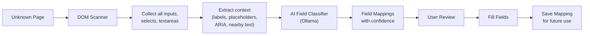

---

# Phase 8 — AI Question Answering

## 8.1 Question Processing Pipeline

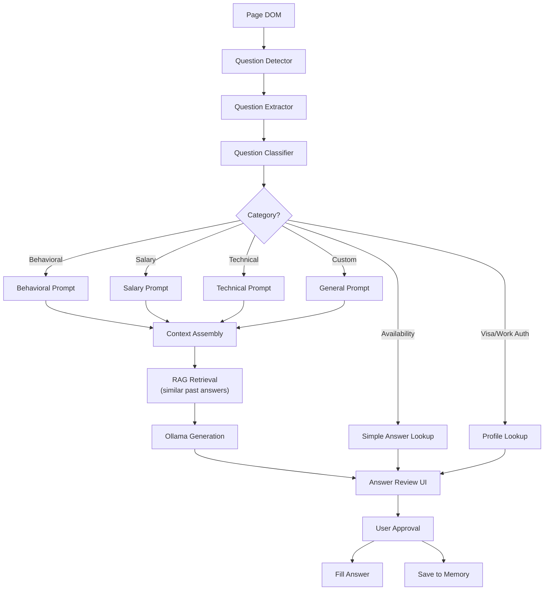

## 8.2 Context Assembly

For each question, the AI receives a carefully assembled context:

```typescript
interface AnswerContext {
  question: {
    text: string;
    category: QuestionCategory;
    maxLength?: number;
    options?: string[];
  };
  resume: {
    summary: string;
    relevantExperience: WorkExperience[];
    relevantSkills: string[];
  };
  jobDescription: {
    title: string;
    company: string;
    requirements: string[];
    description: string;
  };
  companyContext?: {
    mission?: string;
    values?: string[];
    industry: string;
    size?: string;
  };
  previousAnswers: {
    question: string;
    answer: string;
    similarity: number;
  }[];
  userPreferences: {
    tone: 'professional' | 'conversational' | 'enthusiastic';
    length: 'concise' | 'moderate' | 'detailed';
    salaryExpectation?: string;
    noticePeriod?: string;
    workAuthorization?: string;
    willingToRelocate?: boolean;
  };
}
```

## 8.3 Answer Modes

| Mode | Description | User Interaction |
|---|---|---|
| **Manual** | AI suggests, user manually types | Full control |
| **Review** | AI fills, user reviews before submission | Recommended default |
| **Semi-Auto** | AI fills known fields, pauses on low-confidence | Balanced |
| **Copilot** | AI fills everything, shows full review screen | Power users |

---

# Phase 9 — Local Memory (RAG)

## 9.1 RAG Architecture

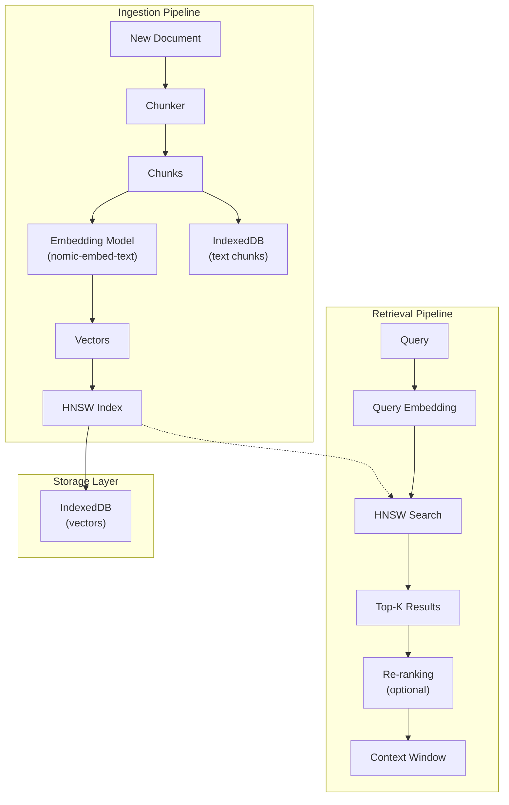

## 9.2 Knowledge Base Schema

```typescript
interface MemoryEntry {
  id: string;
  type: MemoryType;
  content: string;
  embedding: Float32Array;
  metadata: {
    source: string;
    createdAt: string;
    updatedAt: string;
    accessCount: number;
    lastAccessed: string;
    tags: string[];
    relatedEntries: string[];
  };
}

type MemoryType = 
  | 'resume'
  | 'cover_letter'
  | 'job_description'
  | 'application_answer'
  | 'company_info'
  | 'recruiter_note'
  | 'skill'
  | 'interview_note'
  | 'user_note';

interface RAGConfig {
  embeddingModel: string;           // 'nomic-embed-text'
  chunkSize: number;                // 512 tokens
  chunkOverlap: number;             // 50 tokens
  topK: number;                     // 5 results
  similarityThreshold: number;      // 0.7
  maxContextTokens: number;         // 2048
  reranking: boolean;               // false (V1), true (V2)
}
```

## 9.3 Recommendations

| Component | Recommendation | Rationale |
|---|---|---|
| **Embedding Model** | `nomic-embed-text` via Ollama | 8192 token context, 768 dims, good quality, runs locally |
| **Chunking Strategy** | Semantic chunking with 512-token chunks, 50-token overlap | Preserves context at chunk boundaries |
| **Vector Database** | Custom HNSW index stored in IndexedDB | No external dependencies, runs in extension context |
| **Retrieval Strategy** | Top-5 retrieval with similarity threshold 0.7 | Balance between recall and precision |
| **Context Optimization** | Truncate to fit within model's context window, prioritize by relevance score | Prevent context overflow, maximize relevance |

### Why Not ChromaDB/External Vector DBs?

Chrome extensions run in a sandboxed environment. External databases would require a separate server process, defeating the "local-only, no backend" design principle. Instead, we implement a lightweight HNSW (Hierarchical Navigable Small World) index compiled to WASM, with IndexedDB as the persistence layer.

---

# Phase 10 — Browser Automation Engine

## 10.1 Automation Workflow

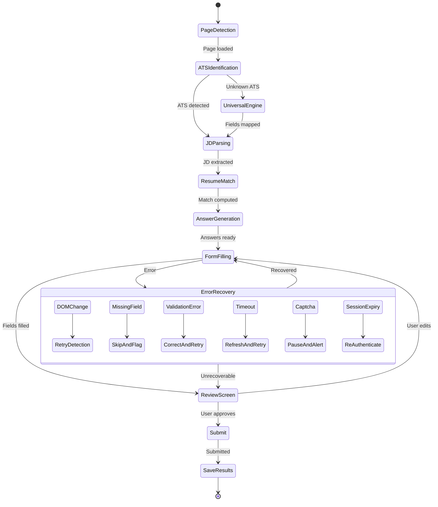

## 10.2 Recovery Strategies

| Failure Mode | Detection Method | Recovery Strategy |
|---|---|---|
| **DOM changes** | MutationObserver, element not found | Re-scan page, re-detect fields, retry with updated selectors |
| **Missing fields** | Expected field not in DOM | Skip field, flag for user review, log for adapter improvement |
| **Validation errors** | Error message elements in DOM, red borders | Parse error text, correct value, re-trigger validation |
| **Timeouts** | Request/operation exceeds time limit | Retry with exponential backoff (max 3 retries) |
| **Captchas** | Known captcha element patterns (reCAPTCHA, hCaptcha) | Pause automation, alert user, resume after manual solve |
| **Unsupported sites** | No adapter match, low detection confidence | Fall back to Universal Form Engine with AI field detection |
| **Infinite scroll** | Page doesn't fully load | Scroll to bottom, wait for content, use IntersectionObserver |
| **Modal dialogs** | Overlay/modal detected over form | Detect and dismiss or handle modal content |
| **Session expiry** | 401/403 response, login page redirect | Alert user to re-authenticate, save progress |
| **Rate limiting** | 429 response, bot detection page | Pause, add human-like delays, alert user |

## 10.3 Human-Like Interaction

To avoid bot detection, all form interactions include:
- **Random delays** between field fills (200–800ms)
- **Typing simulation** for text fields (character-by-character with variable speed)
- **Natural tab order** navigation
- **Scroll-to-element** before interaction
- **Focus/blur event** simulation

---

# Phase 11 — Project Structure

```
src/
├── manifest.json                    # Chrome Extension Manifest V3
├── background/
│   ├── index.ts                     # Service Worker entry
│   ├── messageRouter.ts             # Central message dispatcher
│   ├── handlers/
│   │   ├── aiHandler.ts             # AI request handling
│   │   ├── automationHandler.ts     # Automation coordination
│   │   ├── storageHandler.ts        # Storage operations
│   │   └── analyticsHandler.ts      # Application tracking
│   └── lifecycle.ts                 # Service Worker lifecycle management
│
├── content/
│   ├── index.ts                     # Content script entry
│   ├── detector.ts                  # ATS detection logic
│   ├── overlay.ts                   # Floating UI overlay
│   ├── adapters/
│   │   ├── base.ts                  # Abstract ATSAdapter
│   │   ├── linkedin.ts
│   │   ├── indeed.ts
│   │   ├── greenhouse.ts
│   │   ├── lever.ts
│   │   ├── workday.ts
│   │   ├── ashby.ts
│   │   ├── bamboohr.ts
│   │   ├── smartrecruiters.ts
│   │   ├── jobvite.ts
│   │   ├── wellfound.ts
│   │   └── universal.ts            # Fallback AI-powered adapter
│   ├── formEngine/
│   │   ├── scanner.ts               # DOM field scanner
│   │   ├── filler.ts                # Field value injector
│   │   ├── eventSimulator.ts        # Synthetic event dispatch
│   │   ├── validator.ts             # Form validation watcher
│   │   └── navigator.ts            # Multi-page navigation
│   └── parsers/
│       ├── jobDescriptionParser.ts  # JD text extraction
│       └── questionParser.ts        # Application question detection
│
├── sidepanel/
│   ├── index.html
│   ├── App.tsx                      # Side panel React app
│   ├── pages/
│   │   ├── Dashboard.tsx            # Main dashboard
│   │   ├── JobAnalysis.tsx          # Job match analysis
│   │   ├── Autofill.tsx             # Autofill review screen
│   │   ├── CoverLetter.tsx          # Cover letter generator
│   │   ├── ResumeTailor.tsx         # Resume tailoring
│   │   ├── Applications.tsx         # Application tracker
│   │   └── Profile.tsx              # Profile management
│   ├── components/
│   │   ├── MatchScore.tsx
│   │   ├── FieldReview.tsx
│   │   ├── AnswerEditor.tsx
│   │   ├── ResumeUploader.tsx
│   │   ├── KanbanBoard.tsx
│   │   ├── SkillGap.tsx
│   │   └── AIStatus.tsx
│   └── store/
│       ├── index.ts                 # Zustand store
│       ├── slices/
│       │   ├── profileSlice.ts
│       │   ├── jobSlice.ts
│       │   ├── automationSlice.ts
│       │   └── settingsSlice.ts
│       └── middleware/
│           └── persistence.ts       # chrome.storage sync
│
├── popup/
│   ├── index.html
│   ├── App.tsx                      # Quick-action popup
│   └── components/
│       ├── QuickScore.tsx
│       ├── QuickFill.tsx
│       └── ConnectionStatus.tsx
│
├── options/
│   ├── index.html
│   ├── App.tsx                      # Settings page
│   └── pages/
│       ├── General.tsx
│       ├── AIConfig.tsx             # Ollama settings
│       ├── DataManagement.tsx       # Import/export/delete
│       ├── Privacy.tsx              # Privacy controls
│       └── About.tsx
│
├── offscreen/
│   ├── index.html
│   ├── index.ts                     # Offscreen document entry
│   ├── pdfParser.ts                 # PDF.js text extraction
│   ├── docxParser.ts                # mammoth.js conversion
│   └── ocrEngine.ts                 # Tesseract.js OCR (Web Worker)
│
├── ai/
│   ├── ollama/
│   │   ├── client.ts                # Ollama API client
│   │   ├── streaming.ts             # Stream response handler
│   │   ├── models.ts                # Model management
│   │   └── health.ts                # Connection health checker
│   ├── rag/
│   │   ├── engine.ts                # RAG orchestrator
│   │   ├── chunker.ts               # Text chunking
│   │   ├── retriever.ts             # Similarity search
│   │   └── contextBuilder.ts        # Context window assembly
│   ├── embeddings/
│   │   ├── engine.ts                # Embedding generation
│   │   ├── hnsw.ts                  # HNSW index (WASM)
│   │   └── vectorStore.ts           # IndexedDB vector persistence
│   └── prompts/
│       ├── index.ts                 # Prompt registry
│       ├── resumeParser.ts
│       ├── resumeTailor.ts
│       ├── coverLetter.ts
│       ├── jobMatcher.ts
│       ├── atsOptimizer.ts
│       ├── questionAnswerer.ts
│       ├── skillExtractor.ts
│       ├── companySummarizer.ts
│       └── templates.ts             # Shared prompt templates
│
├── resume/
│   ├── parser.ts                    # Resume parsing orchestrator
│   ├── analyzer.ts                  # ATS analysis
│   ├── tailor.ts                    # Resume tailoring
│   └── matcher.ts                   # Job-resume matching
│
├── storage/
│   ├── chromeStorage.ts             # chrome.storage wrapper
│   ├── indexedDB.ts                 # IndexedDB wrapper
│   ├── migrations.ts                # Schema migrations
│   └── encryption.ts               # Local data encryption
│
├── hooks/
│   ├── useOllama.ts                 # Ollama connection hook
│   ├── useStorage.ts                # Storage hook
│   ├── useAutofill.ts               # Autofill state hook
│   ├── useJobAnalysis.ts            # Job analysis hook
│   └── useRAG.ts                    # RAG query hook
│
├── utils/
│   ├── domUtils.ts                  # DOM manipulation helpers
│   ├── textUtils.ts                 # Text processing
│   ├── dateUtils.ts                 # Date formatting
│   ├── crypto.ts                    # Encryption utilities
│   ├── logger.ts                    # Structured logging
│   └── debounce.ts                  # Timing utilities
│
├── types/
│   ├── resume.ts                    # Resume interfaces
│   ├── job.ts                       # Job/company interfaces
│   ├── adapter.ts                   # ATS adapter interfaces
│   ├── ai.ts                        # AI/prompt interfaces
│   ├── automation.ts                # Automation interfaces
│   ├── storage.ts                   # Storage interfaces
│   ├── messages.ts                  # Message passing types
│   └── settings.ts                  # Settings interfaces
│
├── tests/
│   ├── unit/
│   │   ├── ai/
│   │   ├── adapters/
│   │   ├── resume/
│   │   └── storage/
│   ├── integration/
│   │   ├── ollama.test.ts
│   │   ├── autofill.test.ts
│   │   └── rag.test.ts
│   └── e2e/
│       ├── linkedin.test.ts
│       ├── greenhouse.test.ts
│       └── workday.test.ts
│
└── assets/
    ├── icons/
    │   ├── icon-16.png
    │   ├── icon-32.png
    │   ├── icon-48.png
    │   └── icon-128.png
    ├── fonts/
    └── images/
```

---

# Phase 12 — TypeScript Interfaces

## 12.1 Core Interfaces

```typescript
// ==================== CANDIDATE / PROFILE ====================

interface CandidateProfile {
  id: string;
  name: string;
  resumes: ParsedResume[];
  activeResumeId: string;
  
  personalInfo: {
    firstName: string;
    lastName: string;
    email: string;
    phone: string;
    address: Address;
    dateOfBirth?: string;
    nationality?: string;
  };
  
  workPreferences: {
    desiredTitles: string[];
    desiredLocations: string[];
    remotePreference: 'remote' | 'hybrid' | 'onsite' | 'any';
    salaryExpectation: {
      min: number;
      max: number;
      currency: string;
      period: 'hourly' | 'annual';
    };
    noticePeriod: string;
    availableStartDate?: string;
    willingToRelocate: boolean;
    workAuthorization: string;
    visaSponsorship: boolean;
  };
  
  screeningAnswers: Map<string, ScreeningAnswer>;
  
  createdAt: string;
  updatedAt: string;
}

interface Address {
  street?: string;
  city: string;
  state: string;
  zipCode: string;
  country: string;
}

interface ScreeningAnswer {
  questionPattern: string;  // regex or keyword pattern
  answer: string;
  category: QuestionCategory;
  lastUsed: string;
  useCount: number;
}

// ==================== JOB ====================

interface Job {
  id: string;
  title: string;
  company: Company;
  location: string;
  type: 'full_time' | 'part_time' | 'contract' | 'internship' | 'temporary';
  remote: 'remote' | 'hybrid' | 'onsite';
  salaryRange?: {
    min: number;
    max: number;
    currency: string;
    period: 'hourly' | 'annual';
  };
  description: string;
  requirements: {
    required: string[];
    preferred: string[];
  };
  skills: string[];
  experienceLevel: string;
  educationRequirement?: string;
  url: string;
  source: string;         // 'linkedin', 'greenhouse', etc.
  postedDate?: string;
  deadline?: string;
  
  // Computed
  matchScore?: number;
  matchDetails?: MatchReport;
  
  createdAt: string;
}

interface Company {
  name: string;
  website?: string;
  industry?: string;
  size?: string;
  location?: string;
  description?: string;
  mission?: string;
  values?: string[];
  glassdoorRating?: number;
}

// ==================== APPLICATION ====================

interface Application {
  id: string;
  jobId: string;
  profileId: string;
  resumeId: string;
  
  status: ApplicationStatus;
  statusHistory: StatusChange[];
  
  appliedAt: string;
  lastUpdated: string;
  
  answers: ApplicationAnswer[];
  coverLetterId?: string;
  tailoredResumeId?: string;
  
  notes: string;
  tags: string[];
  
  automationLog: AutomationLogEntry[];
  
  source: string;  // ATS name
  externalId?: string;  // ID on the platform
}

type ApplicationStatus = 
  | 'draft'
  | 'in_progress'
  | 'submitted'
  | 'viewed'
  | 'screened'
  | 'interview_scheduled'
  | 'interviewing'
  | 'offer'
  | 'rejected'
  | 'withdrawn'
  | 'archived';

interface StatusChange {
  from: ApplicationStatus;
  to: ApplicationStatus;
  timestamp: string;
  note?: string;
}

interface ApplicationAnswer {
  questionId: string;
  questionText: string;
  answer: string;
  generatedByAI: boolean;
  editedByUser: boolean;
  confidence: number;
  category: QuestionCategory;
  versions: AnswerVersion[];
}

interface AnswerVersion {
  content: string;
  timestamp: string;
  source: 'ai_generated' | 'user_edited' | 'from_memory';
}

// ==================== AI ====================

interface AIPrompt {
  id: string;
  name: string;
  task: AITask;
  systemPrompt: string;
  userPromptTemplate: string;
  outputSchema?: object;     // JSON Schema for structured output
  temperature: number;
  maxTokens: number;
  model?: string;            // override default model
  version: number;
}

type AITask = 
  | 'resume_parse'
  | 'resume_tailor'
  | 'cover_letter'
  | 'job_match'
  | 'ats_optimize'
  | 'question_answer'
  | 'skill_extract'
  | 'company_summarize'
  | 'field_classify';

interface AIResponse {
  id: string;
  promptId: string;
  model: string;
  content: string;
  parsedContent?: object;
  tokensUsed: {
    prompt: number;
    completion: number;
    total: number;
  };
  latencyMs: number;
  cached: boolean;
  timestamp: string;
}

interface AIStreamChunk {
  content: string;
  done: boolean;
  model: string;
  tokensGenerated: number;
}

// ==================== AUTOMATION ====================

interface AutomationResult {
  id: string;
  adapterId: string;
  jobId: string;
  
  status: 'success' | 'partial' | 'failed' | 'cancelled';
  
  fieldsFilled: number;
  fieldsTotal: number;
  fieldsSkipped: number;
  fieldsFailed: number;
  
  questionsAnswered: number;
  questionsTotal: number;
  
  errors: AutomationError[];
  warnings: string[];
  
  startTime: string;
  endTime: string;
  durationMs: number;
}

interface AutomationError {
  code: string;
  message: string;
  fieldId?: string;
  recoverable: boolean;
  recoveryAction?: string;
  timestamp: string;
}

interface AutomationLogEntry {
  timestamp: string;
  action: string;
  target?: string;
  result: 'success' | 'failure' | 'skipped';
  details?: string;
}

// ==================== MEMORY / RAG ====================

interface EmbeddingRecord {
  id: string;
  memoryEntryId: string;
  vector: Float32Array;
  model: string;
  dimensions: number;
  createdAt: string;
}

interface RAGQuery {
  query: string;
  topK: number;
  filter?: {
    types?: MemoryType[];
    dateRange?: { from: string; to: string };
    tags?: string[];
  };
  minSimilarity: number;
}

interface RAGResult {
  entries: {
    entry: MemoryEntry;
    similarity: number;
    rank: number;
  }[];
  queryEmbedding: Float32Array;
  searchTimeMs: number;
}

// ==================== SETTINGS ====================

interface ExtensionSettings {
  // AI Configuration
  ai: {
    ollamaUrl: string;
    primaryModel: string;
    embeddingModel: string;
    temperature: number;
    maxTokens: number;
    contextLength: number;
    streamResponses: boolean;
  };
  
  // Automation
  automation: {
    defaultMode: 'manual' | 'review' | 'semi_auto' | 'copilot';
    typingDelay: { min: number; max: number };
    fieldDelay: { min: number; max: number };
    autoSaveProgress: boolean;
    maxRetries: number;
  };
  
  // Privacy
  privacy: {
    encryptLocalData: boolean;
    clearDataOnUninstall: boolean;
    telemetry: boolean;  // always false by default
    allowRemoteAI: boolean;  // always false by default
  };
  
  // UI
  ui: {
    theme: 'light' | 'dark' | 'system';
    showOverlay: boolean;
    sidePanel: boolean;
    notifications: boolean;
    language: string;
  };
  
  // Answer Generation
  answers: {
    tone: 'professional' | 'conversational' | 'enthusiastic';
    length: 'concise' | 'moderate' | 'detailed';
    autoGenerateForKnownQuestions: boolean;
    saveAllAnswers: boolean;
  };
}

// ==================== MESSAGES ====================

// Type-safe message passing between extension contexts

type MessageType =
  | { type: 'ANALYZE_PAGE'; payload: { tabId: number } }
  | { type: 'PAGE_DATA'; payload: PageAnalysis }
  | { type: 'START_AUTOFILL'; payload: { profileId: string; jobId: string } }
  | { type: 'FILL_FIELD'; payload: { fieldId: string; value: string } }
  | { type: 'FILL_RESULT'; payload: FillResult }
  | { type: 'GENERATE_ANSWER'; payload: { question: ApplicationQuestion; context: AnswerContext } }
  | { type: 'AI_RESPONSE'; payload: AIResponse }
  | { type: 'AI_STREAM_CHUNK'; payload: AIStreamChunk }
  | { type: 'PARSE_RESUME'; payload: { file: ArrayBuffer; type: string } }
  | { type: 'RESUME_PARSED'; payload: ParsedResume }
  | { type: 'MATCH_JOB'; payload: { resumeId: string; jobId: string } }
  | { type: 'MATCH_RESULT'; payload: MatchReport }
  | { type: 'OLLAMA_STATUS'; payload: OllamaStatus }
  | { type: 'ERROR'; payload: { code: string; message: string } };

interface PageAnalysis {
  url: string;
  atsDetected: ATSDetectionResult;
  jobDescription?: ParsedJobDescription;
  formFields: FormField[];
  questions: ApplicationQuestion[];
}

interface MatchReport {
  overallScore: number;
  requiredSkillsMatch: number;
  preferredSkillsMatch: number;
  experienceMatch: number;
  educationMatch: number;
  semanticSimilarity: number;
  keywordCoverage: number;
  
  matchedSkills: string[];
  missingRequiredSkills: string[];
  missingPreferredSkills: string[];
  
  suggestions: ResumeSuggestion[];
  
  atsScore: number;
  atsIssues: ATSIssue[];
}

interface ResumeSuggestion {
  type: 'add_skill' | 'rewrite_bullet' | 'add_keyword' | 'reorder' | 'format_fix';
  target: string;
  suggestion: string;
  impact: 'high' | 'medium' | 'low';
}

interface OllamaStatus {
  connected: boolean;
  url: string;
  version?: string;
  models: OllamaModel[];
  primaryModelLoaded: boolean;
  embeddingModelLoaded: boolean;
}

interface OllamaModel {
  name: string;
  size: number;
  quantization: string;
  parameterSize: string;
  modifiedAt: string;
}
```

---

# Phase 13 — Prompt Library

## 13.1 Resume Parser Prompt

```typescript
const RESUME_PARSER_PROMPT: AIPrompt = {
  id: 'resume-parser-v1',
  name: 'Resume Parser',
  task: 'resume_parse',
  temperature: 0.1,  // Low temperature for accuracy
  maxTokens: 4096,
  systemPrompt: `You are a precise resume parser. Extract structured information from the provided resume text.

RULES:
- Extract ONLY information explicitly present in the text
- Never infer or fabricate information
- Use ISO 8601 dates (YYYY-MM-DD) where possible, or "YYYY-MM" for month precision
- If a field is not found, use null
- Normalize skill names to their standard form (e.g., "JS" → "JavaScript")
- Separate distinct skills even when listed together
- Parse each bullet point as a separate achievement
- Identify quantified metrics in achievements (numbers, percentages, dollar amounts)`,

  userPromptTemplate: `Parse the following resume text into structured JSON:

<resume>
{{resumeText}}
</resume>

Return valid JSON matching this exact schema. Do not include any text outside the JSON object.`,

  outputSchema: {/* ParsedResume JSON Schema */},
  version: 1
};
```

## 13.2 Resume Tailoring Prompt

```typescript
const RESUME_TAILOR_PROMPT: AIPrompt = {
  id: 'resume-tailor-v1',
  name: 'Resume Tailor',
  task: 'resume_tailor',
  temperature: 0.5,
  maxTokens: 3000,
  systemPrompt: `You are an expert resume optimizer. Rewrite resume bullet points to better match a job description.

RULES:
- NEVER add skills, experience, or qualifications the candidate does not have
- NEVER fabricate metrics, numbers, or achievements
- Rewrite bullets to emphasize relevant keywords from the job description
- Reorder skills to prioritize those mentioned in the job description
- Maintain truthful content while optimizing language
- Use strong action verbs at the start of each bullet
- Quantify achievements where the original data supports it
- Match the terminology used in the job description (e.g., if JD says "Agile" don't change it to "Scrum" unless both are mentioned)`,

  userPromptTemplate: `Given the following resume and job description, tailor the resume content.

<resume>
{{resumeJSON}}
</resume>

<job_description>
{{jobDescription}}
</job_description>

Return JSON with this structure:
{
  "tailoredBullets": [
    {
      "originalBullet": "string",
      "tailoredBullet": "string",
      "changesExplanation": "string",
      "keywordsAdded": ["string"]
    }
  ],
  "skillsReordered": ["string"],
  "summaryRewrite": "string",
  "keywordsFromJD": ["string"],
  "keywordsCovered": ["string"],
  "keywordsMissing": ["string"]
}`,
  version: 1
};
```

## 13.3 Cover Letter Generation Prompt

```typescript
const COVER_LETTER_PROMPT: AIPrompt = {
  id: 'cover-letter-v1',
  name: 'Cover Letter Generator',
  task: 'cover_letter',
  temperature: 0.7,
  maxTokens: 2000,
  systemPrompt: `You are an expert cover letter writer. Write compelling, personalized cover letters.

RULES:
- Write in first person, professional tone
- Open with a strong hook — not "I am writing to apply for..."
- Connect the candidate's specific experience to the company's needs
- Reference the company by name and demonstrate knowledge of their mission/product
- Include 2-3 specific achievements from the resume that are most relevant
- Close with a clear call to action
- Keep to 3-4 paragraphs, approximately 250-350 words
- Never use generic filler phrases
- Match the tone to the company culture (startup vs. enterprise)
- Do NOT fabricate any experience or qualifications`,

  userPromptTemplate: `Write a cover letter for the following application:

<candidate_profile>
{{candidateJSON}}
</candidate_profile>

<job_description>
{{jobDescription}}
</job_description>

<company_info>
{{companyContext}}
</company_info>

<style>
Tone: {{tone}}
Length: {{length}}
</style>

Return JSON:
{
  "coverLetter": "string (the full cover letter text)",
  "keyThemes": ["string (main themes emphasized)"],
  "matchedRequirements": ["string (JD requirements addressed)"],
  "suggestedSubjectLine": "string"
}`,
  version: 1
};
```

## 13.4 Job Matching Prompt

```typescript
const JOB_MATCHER_PROMPT: AIPrompt = {
  id: 'job-matcher-v1',
  name: 'Job Matcher',
  task: 'job_match',
  temperature: 0.2,
  maxTokens: 2000,
  systemPrompt: `You are a job-resume matching analyst. Compare a candidate's resume against a job description and produce a detailed match analysis.

RULES:
- Score each category independently on a 0-100 scale
- Be objective and specific — cite exact skills and requirements
- Distinguish between "required" and "preferred/nice-to-have" qualifications
- Account for skill synonyms (React.js = ReactJS = React)
- Consider transferable skills and adjacent experience
- Provide actionable, specific improvement suggestions`,

  userPromptTemplate: `Analyze the match between this resume and job description:

<resume>
{{resumeJSON}}
</resume>

<job_description>
{{jobDescription}}
</job_description>

Return JSON:
{
  "overallScore": number,
  "breakdown": {
    "requiredSkillsScore": number,
    "preferredSkillsScore": number,
    "experienceScore": number,
    "educationScore": number,
    "keywordCoverageScore": number
  },
  "matchedSkills": ["string"],
  "missingRequiredSkills": ["string"],
  "missingPreferredSkills": ["string"],
  "experienceGaps": ["string"],
  "strengths": ["string"],
  "suggestions": [
    {
      "type": "add_skill | rewrite_bullet | add_keyword | reorder",
      "description": "string",
      "impact": "high | medium | low"
    }
  ]
}`,
  version: 1
};
```

## 13.5 ATS Optimization Prompt

```typescript
const ATS_OPTIMIZER_PROMPT: AIPrompt = {
  id: 'ats-optimizer-v1',
  name: 'ATS Optimizer',
  task: 'ats_optimize',
  temperature: 0.3,
  maxTokens: 2000,
  systemPrompt: `You are an ATS (Applicant Tracking System) optimization expert. Analyze resumes for ATS compatibility.

RULES:
- Check for standard section headers that ATS systems recognize
- Identify formatting issues (tables, columns, headers/footers, images)
- Verify keyword presence and density
- Check date format consistency
- Ensure contact information is clearly parseable
- Score on a 0-100 scale
- Provide specific, actionable fixes`,

  userPromptTemplate: `Analyze this resume for ATS compatibility:

<resume_text>
{{resumeText}}
</resume_text>

<target_job_description>
{{jobDescription}}
</target_job_description>

Return JSON:
{
  "atsScore": number,
  "formatScore": number,
  "keywordScore": number,
  "structureScore": number,
  "readabilityScore": number,
  "issues": [
    {
      "severity": "critical | warning | info",
      "category": "format | keyword | structure | readability",
      "description": "string",
      "fix": "string",
      "location": "string"
    }
  ],
  "missingKeywords": ["string"],
  "keywordDensity": { "keyword": number },
  "parsedSections": ["string"],
  "missingSections": ["string"]
}`,
  version: 1
};
```

## 13.6 Question Answering Prompt

```typescript
const QUESTION_ANSWERER_PROMPT: AIPrompt = {
  id: 'question-answerer-v1',
  name: 'Question Answerer',
  task: 'question_answer',
  temperature: 0.6,
  maxTokens: 1000,
  systemPrompt: `You are an expert job application assistant. Generate professional, personalized answers to job application questions.

RULES:
- Base ALL answers on the provided resume and profile data
- NEVER fabricate experience, skills, or qualifications
- Match the tone to the question type (formal for behavioral, precise for technical)
- Respect any character/word limits specified
- For salary questions, use the candidate's stated preference
- For yes/no questions, answer clearly then briefly elaborate
- For behavioral questions, use the STAR method (Situation, Task, Action, Result)
- Draw from the most relevant experience for each question
- If similar past answers exist, use them as reference while keeping the response fresh
- Be specific and avoid generic corporate language`,

  userPromptTemplate: `Answer the following application question:

<question>
{{questionText}}
</question>
<question_type>{{questionCategory}}</question_type>
<max_length>{{maxLength}}</max_length>

<candidate_profile>
{{profileJSON}}
</candidate_profile>

<relevant_experience>
{{relevantExperience}}
</relevant_experience>

<job_context>
Title: {{jobTitle}}
Company: {{companyName}}
Description: {{jobDescription}}
</job_context>

<similar_past_answers>
{{pastAnswers}}
</similar_past_answers>

Return JSON:
{
  "answer": "string",
  "confidence": number,
  "reasoning": "string (why this answer was generated)",
  "keyPointsUsed": ["string (resume items referenced)"],
  "alternativeAnswer": "string (a shorter/different version)"
}`,
  version: 1
};
```

## 13.7 Skill Extraction Prompt

```typescript
const SKILL_EXTRACTOR_PROMPT: AIPrompt = {
  id: 'skill-extractor-v1',
  name: 'Skill Extractor',
  task: 'skill_extract',
  temperature: 0.1,
  maxTokens: 1500,
  systemPrompt: `You are a skill extraction specialist. Extract and categorize all skills from job descriptions and resumes.

RULES:
- Extract explicit and implicit skills (e.g., "building REST APIs" implies REST, API Design, Backend Development)
- Categorize skills into: Technical, Soft, Tools, Frameworks, Languages, Platforms, Methodologies, Domain
- Normalize skill names to industry-standard forms
- Include proficiency indicators when mentioned
- Distinguish between required and preferred skills in job descriptions`,

  userPromptTemplate: `Extract all skills from the following text:

<text>
{{inputText}}
</text>
<source_type>{{sourceType}}</source_type>

Return JSON:
{
  "skills": [
    {
      "name": "string",
      "category": "technical | soft | tool | framework | language | platform | methodology | domain",
      "level": "required | preferred | mentioned",
      "proficiency": "beginner | intermediate | advanced | expert | null",
      "synonyms": ["string"],
      "context": "string (sentence where it was found)"
    }
  ],
  "totalCount": number,
  "topSkills": ["string (top 10 most important)"]
}`,
  version: 1
};
```

## 13.8 Company Summarization Prompt

```typescript
const COMPANY_SUMMARIZER_PROMPT: AIPrompt = {
  id: 'company-summarizer-v1',
  name: 'Company Summarizer',
  task: 'company_summarize',
  temperature: 0.4,
  maxTokens: 1000,
  systemPrompt: `You are a company research analyst. Summarize company information from their website and job description to help candidates tailor their applications.

RULES:
- Extract key facts: industry, size, products/services, mission, values
- Identify company culture signals from the job description language
- Note any specific technologies, methodologies, or practices mentioned
- Highlight what the company values in candidates based on the JD tone`,

  userPromptTemplate: `Summarize this company for a job applicant:

<company_name>{{companyName}}</company_name>
<job_description>{{jobDescription}}</job_description>
<company_page_text>{{companyPageText}}</company_page_text>

Return JSON:
{
  "name": "string",
  "industry": "string",
  "size": "string",
  "products": ["string"],
  "mission": "string",
  "values": ["string"],
  "culture": "string",
  "techStack": ["string"],
  "keyInsights": ["string (useful for cover letters and interviews)"],
  "interviewTips": ["string"]
}`,
  version: 1
};
```

## 13.9 Application Scoring Prompt

```typescript
const APPLICATION_SCORER_PROMPT: AIPrompt = {
  id: 'application-scorer-v1',
  name: 'Application Scorer',
  task: 'job_match',
  temperature: 0.2,
  maxTokens: 800,
  systemPrompt: `You are an application quality assessor. Review a completed job application (resume, cover letter, answers) and score its quality and likelihood of getting a callback.

RULES:
- Score on a 0-100 scale
- Evaluate: resume relevance, cover letter quality, answer completeness, keyword coverage
- Provide a brief assessment and top 3 improvement suggestions
- Be realistic — don't inflate scores`,

  userPromptTemplate: `Score this completed application:

<job>{{jobDescription}}</job>
<resume>{{resumeJSON}}</resume>
<cover_letter>{{coverLetter}}</cover_letter>
<answers>{{answersJSON}}</answers>

Return JSON:
{
  "overallScore": number,
  "resumeRelevance": number,
  "coverLetterQuality": number,
  "answerCompleteness": number,
  "keywordCoverage": number,
  "assessment": "string",
  "topImprovements": ["string"],
  "readyToSubmit": boolean
}`,
  version: 1
};
```

---

# Phase 14 — Security & Privacy

## 14.1 Privacy Architecture

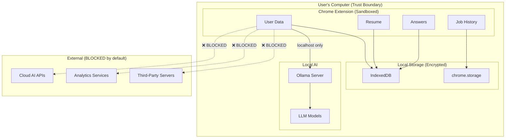

## 14.2 Security Principles

### 1. Zero Data Exfiltration
- **No network requests** to any server except `localhost:11434` (Ollama)
- **No analytics**, telemetry, or tracking — ever (unless user explicitly opts in for crash reports)
- **No CDN-loaded resources** — all assets bundled in extension
- **Content Security Policy** strictly locks down allowed origins

```json
{
  "content_security_policy": {
    "extension_pages": "script-src 'self'; connect-src http://localhost:11434 http://127.0.0.1:11434; object-src 'none'"
  }
}
```

### 2. Principle of Least Privilege

```json
{
  "permissions": [
    "storage",
    "activeTab",
    "sidePanel",
    "offscreen"
  ],
  "optional_permissions": [
    "tabs",
    "notifications"
  ],
  "host_permissions": [
    "http://localhost:11434/*",
    "http://127.0.0.1:11434/*"
  ]
}
```

- **No `<all_urls>`** — content scripts are injected only on matching ATS domains
- **`activeTab`** instead of broad tab access
- **Optional permissions** requested only when features are used
- **No `webRequest`** or `webNavigation` unless strictly required

### 3. Local Data Encryption

```typescript
interface EncryptionConfig {
  algorithm: 'AES-GCM';
  keyLength: 256;
  ivLength: 12;
  tagLength: 128;
  keyDerivation: 'PBKDF2';
  iterations: 100000;
  salt: Uint8Array;  // Generated per-installation
}
```

- **Sensitive fields** (resume text, answers, personal info) encrypted at rest in IndexedDB
- **Encryption key** derived from a user-set passphrase via PBKDF2
- **Web Crypto API** for all cryptographic operations (native browser, no dependencies)
- **Optional:** Users can disable encryption for performance (documented trade-off)

### 4. Transparency & Auditability

- **Automation log:** Every automated action (field fill, page navigation, AI query) is logged with timestamps
- **Review mode:** Users always see what will be submitted before any form submission
- **AI transparency:** Show the exact prompt sent to Ollama for each generation
- **Data export:** Users can export all stored data as JSON at any time
- **Data deletion:** One-click purge of all stored data

### 5. Content Script Isolation

- Content scripts run in an isolated world — they can read the DOM but cannot access the page's JavaScript context
- All sensitive logic (AI calls, storage access) runs in the Service Worker
- Content scripts communicate exclusively via `chrome.runtime.sendMessage`
- No `eval()`, no dynamic code injection, no `innerHTML` with untrusted content

---

# Phase 15 — Development Roadmap

## Milestone 1: Extension Skeleton
**Goal:** Set up the project foundation with all build tooling and extension contexts.

| Aspect | Detail |
|---|---|
| **Deliverables** | Manifest V3 config, Vite build pipeline, React setup for popup/sidepanel/options, Service Worker scaffold, TypeScript config, TailwindCSS setup, folder structure |
| **Dependencies** | None |
| **Estimated Effort** | 1 week (1 developer) |
| **Testing Plan** | Extension loads in Chrome, all contexts (popup, side panel, options, background) render correctly, HMR works |
| **Risks** | Vite + Chrome Extension build quirks; mitigated by using `@crxjs/vite-plugin` or `vite-plugin-chrome-extension` |

---

## Milestone 2: Local Storage Layer
**Goal:** Implement persistent storage with chrome.storage and IndexedDB wrappers.

| Aspect | Detail |
|---|---|
| **Deliverables** | ChromeStorage wrapper, IndexedDB wrapper with typed collections, schema migration system, data export/import, encryption module |
| **Dependencies** | Milestone 1 |
| **Estimated Effort** | 1 week |
| **Testing Plan** | Unit tests for CRUD operations, migration tests, encryption round-trip tests |
| **Risks** | IndexedDB quota limits on some browsers; mitigated by implementing storage cleanup and quota monitoring |

---

## Milestone 3: Ollama Integration
**Goal:** Connect to local Ollama, verify models, implement streaming client.

| Aspect | Detail |
|---|---|
| **Deliverables** | OllamaClient class, streaming response handler, model health check, connection status UI, setup wizard for first-time users |
| **Dependencies** | Milestone 1 |
| **Estimated Effort** | 1 week |
| **Testing Plan** | Integration tests with running Ollama instance, mock tests for offline, error handling for connection failures |
| **Risks** | CORS issues; mitigated by clear setup instructions and automatic detection of misconfigured Ollama |

---

## Milestone 4: Resume Parser
**Goal:** Import and parse PDF/DOCX resumes into structured JSON.

| Aspect | Detail |
|---|---|
| **Deliverables** | Offscreen document with PDF.js and mammoth.js, AI-powered section detection, structured JSON output, resume management UI |
| **Dependencies** | Milestones 2, 3 |
| **Estimated Effort** | 2 weeks |
| **Testing Plan** | Parse 50+ real resumes across formats, validate JSON schema compliance, OCR accuracy tests |
| **Risks** | Complex resume layouts may produce poor text extraction; mitigated by OCR fallback and manual correction UI |

---

## Milestone 5: AI Engine & Prompt Library
**Goal:** Build the AI orchestration layer with all production prompts.

| Aspect | Detail |
|---|---|
| **Deliverables** | Prompt manager, response parser, structured output validation, caching layer, all 9 prompt templates, prompt testing harness |
| **Dependencies** | Milestone 3 |
| **Estimated Effort** | 2 weeks |
| **Testing Plan** | Quality benchmarks for each prompt with 20+ test cases, JSON output validation, latency benchmarks |
| **Risks** | Model output inconsistency; mitigated by strict JSON schemas via Ollama's `format` parameter and retry with validation feedback |

---

## Milestone 6: LinkedIn Adapter
**Goal:** Full autofill support for LinkedIn Easy Apply.

| Aspect | Detail |
|---|---|
| **Deliverables** | LinkedIn adapter (detect, parse JD, parse form, fill fields, handle multi-step), content script injection, overlay UI |
| **Dependencies** | Milestones 4, 5 |
| **Estimated Effort** | 2 weeks |
| **Testing Plan** | Manual testing on 20+ LinkedIn job applications across job types, regression testing for DOM changes |
| **Risks** | LinkedIn DOM changes frequently and has bot detection; mitigated by human-like delays, robust selectors, adapter versioning |

---

## Milestone 7: Greenhouse Adapter
**Goal:** Full autofill support for Greenhouse-hosted application forms.

| Aspect | Detail |
|---|---|
| **Deliverables** | Greenhouse adapter with full form support, file upload, custom question handling |
| **Dependencies** | Milestone 6 (shared form engine) |
| **Estimated Effort** | 1 week |
| **Testing Plan** | Test on 15+ Greenhouse application pages |
| **Risks** | Low — Greenhouse has relatively stable, semantic HTML |

---

## Milestone 8: Workday Adapter
**Goal:** Full autofill support for Workday applications.

| Aspect | Detail |
|---|---|
| **Deliverables** | Workday adapter with multi-page wizard support, dynamic field detection, MutationObserver-based navigation |
| **Dependencies** | Milestone 6 |
| **Estimated Effort** | 3 weeks |
| **Testing Plan** | Test on 20+ Workday applications from different companies; regression suite for common Workday configurations |
| **Risks** | **High** — Workday is the most complex ATS with frequent UI changes. Mitigated by AI-powered field detection fallback |

---

## Milestone 9: Universal Form Engine
**Goal:** AI-powered fallback for unsupported ATS platforms.

| Aspect | Detail |
|---|---|
| **Deliverables** | Universal adapter using AI field classification, field mapping persistence, user correction workflow, adapters for Lever, Ashby, BambooHR, SmartRecruiters, Jobvite, Wellfound |
| **Dependencies** | Milestones 5, 6 |
| **Estimated Effort** | 2 weeks |
| **Testing Plan** | Test on 30+ different career pages including obscure ATS platforms |
| **Risks** | AI field classification accuracy; mitigated by user correction loop and persistent mappings |

---

## Milestone 10: Local RAG
**Goal:** Implement local vector database and retrieval-augmented generation.

| Aspect | Detail |
|---|---|
| **Deliverables** | HNSW index (WASM), embedding pipeline, chunking engine, IndexedDB vector persistence, context builder, RAG query API |
| **Dependencies** | Milestones 2, 3 |
| **Estimated Effort** | 2 weeks |
| **Testing Plan** | Retrieval quality benchmarks (precision@K, recall@K), embedding latency tests, index size stress tests |
| **Risks** | HNSW WASM performance in extension context; mitigated by off-thread computation and index size limits |

---

## Milestone 11: AI Answer Generator
**Goal:** Full question detection, classification, and answer generation with RAG context.

| Aspect | Detail |
|---|---|
| **Deliverables** | Question detector, classifier, context assembler, answer generator with RAG, answer review UI, answer memory system |
| **Dependencies** | Milestones 5, 10 |
| **Estimated Effort** | 2 weeks |
| **Testing Plan** | Answer quality assessment on 100+ real application questions, category classification accuracy, RAG relevance |
| **Risks** | Answer quality for edge-case questions; mitigated by confidence scoring and mandatory user review |

---

## Milestone 12: Comprehensive Testing
**Goal:** Full test coverage and quality assurance.

| Aspect | Detail |
|---|---|
| **Deliverables** | Unit test suite (Vitest), integration tests, E2E tests (Playwright), performance benchmarks, accessibility audit |
| **Dependencies** | All previous milestones |
| **Estimated Effort** | 2 weeks |
| **Testing Plan** | >80% code coverage, all adapters tested, all AI prompts benchmarked, performance within acceptable bounds |
| **Risks** | E2E test flakiness on live job sites; mitigated by using recorded DOM snapshots |

---

## Milestone 13: Packaging & Documentation
**Goal:** Production build, Chrome Web Store preparation, user documentation.

| Aspect | Detail |
|---|---|
| **Deliverables** | Optimized production build, Chrome Web Store listing, README, installation guide, user guide, API documentation, contributing guide |
| **Dependencies** | Milestone 12 |
| **Estimated Effort** | 1 week |
| **Testing Plan** | Fresh install testing, documentation review, cross-platform Ollama setup verification (Windows, macOS, Linux) |
| **Risks** | Chrome Web Store review rejection; mitigated by strict compliance with MV3 policies |

---

## Milestone 14: Open Source Release
**Goal:** Public release with community infrastructure.

| Aspect | Detail |
|---|---|
| **Deliverables** | GitHub repository, LICENSE (MIT), CONTRIBUTING.md, issue templates, PR templates, CI/CD (GitHub Actions), release automation |
| **Dependencies** | Milestone 13 |
| **Estimated Effort** | 1 week |
| **Testing Plan** | External contributor test (can clone, build, run, contribute), CI pipeline green on all platforms |
| **Risks** | Community management overhead; mitigated by clear contribution guidelines and issue templates |

---

## Timeline Summary

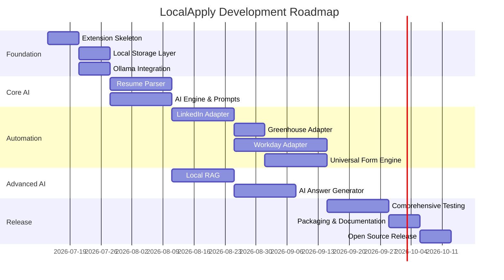

**Total estimated effort:** ~22 weeks (5.5 months) with a single developer, or ~11 weeks (2.75 months) with 2 developers working in parallel.

---

# Appendix A — Manifest V3 Configuration

```json
{
  "manifest_version": 3,
  "name": "LocalApply — AI Job Application Copilot",
  "version": "1.0.0",
  "description": "Open-source, privacy-first AI job application assistant powered by local Ollama.",
  
  "permissions": [
    "storage",
    "activeTab",
    "sidePanel",
    "offscreen"
  ],
  
  "optional_permissions": [
    "tabs",
    "notifications"
  ],
  
  "host_permissions": [
    "http://localhost:11434/*",
    "http://127.0.0.1:11434/*"
  ],
  
  "background": {
    "service_worker": "src/background/index.ts",
    "type": "module"
  },
  
  "content_scripts": [
    {
      "matches": [
        "*://*.linkedin.com/jobs/*",
        "*://*.indeed.com/*",
        "*://boards.greenhouse.io/*",
        "*://*.greenhouse.io/*",
        "*://jobs.lever.co/*",
        "*://*.myworkdayjobs.com/*",
        "*://*.ashbyhq.com/*",
        "*://*.bamboohr.com/careers/*",
        "*://jobs.smartrecruiters.com/*",
        "*://*.jobvite.com/*",
        "*://wellfound.com/jobs/*"
      ],
      "js": ["src/content/index.ts"],
      "css": ["src/content/overlay.css"],
      "run_at": "document_idle"
    }
  ],
  
  "action": {
    "default_popup": "src/popup/index.html",
    "default_icon": {
      "16": "assets/icons/icon-16.png",
      "32": "assets/icons/icon-32.png",
      "48": "assets/icons/icon-48.png",
      "128": "assets/icons/icon-128.png"
    }
  },
  
  "side_panel": {
    "default_path": "src/sidepanel/index.html"
  },
  
  "options_page": "src/options/index.html",
  
  "content_security_policy": {
    "extension_pages": "script-src 'self' 'wasm-unsafe-eval'; connect-src http://localhost:11434 http://127.0.0.1:11434; object-src 'none'"
  },
  
  "icons": {
    "16": "assets/icons/icon-16.png",
    "32": "assets/icons/icon-32.png",
    "48": "assets/icons/icon-48.png",
    "128": "assets/icons/icon-128.png"
  }
}
```

---

# Appendix B — Testing Strategy

## Test Pyramid

| Level | Tool | Coverage Target | What to Test |
|---|---|---|---|
| **Unit** | Vitest | >85% | Pure functions, utilities, parsers, prompt builders, storage operations |
| **Integration** | Vitest + JSDOM | >70% | AI pipeline (prompt → Ollama → parse), storage round-trips, message passing |
| **Component** | React Testing Library | >75% | UI components, user interactions, state management |
| **E2E** | Playwright | Key flows | Full autofill workflow on recorded DOM snapshots of each ATS |
| **Performance** | Custom benchmarks | All AI tasks | Latency targets: <2s for scoring, <10s for generation, <30s for resume parsing |

## Quality Gates

Before each release:
1. All unit + integration tests pass
2. E2E tests pass on recorded snapshots
3. AI prompt benchmarks meet quality thresholds
4. No high/critical security issues in dependency audit
5. Bundle size under 5MB (excluding WASM modules)
6. Memory usage under 200MB during normal operation

---

# Appendix C — Deployment Guide

## User Installation

1. Install [Ollama](https://ollama.com) on your machine
2. Pull the recommended models:
   ```bash
   ollama pull qwen3:8b
   ollama pull nomic-embed-text
   ```
3. Configure CORS for the extension:
   - **Windows:** `setx OLLAMA_ORIGINS "chrome-extension://*" /M` (run as Admin)
   - **macOS/Linux:** `export OLLAMA_ORIGINS="chrome-extension://*"` (add to shell profile)
4. Restart Ollama
5. Install LocalApply from Chrome Web Store (or load unpacked for development)
6. Click the extension icon → Setup Wizard will guide through first-time configuration

## Developer Setup

```bash
git clone https://github.com/localapply/localapply.git
cd localapply
npm install
npm run dev      # Start Vite dev server with HMR
# Load the dist/ folder as unpacked extension in chrome://extensions
```

---

# Appendix D — Future Architecture Considerations

## Plugin System (V2+)

```typescript
interface LocalApplyPlugin {
  id: string;
  name: string;
  version: string;
  type: 'ats_adapter' | 'ai_provider' | 'prompt_pack' | 'ui_theme';
  
  // Lifecycle
  onInstall(): Promise<void>;
  onActivate(): Promise<void>;
  onDeactivate(): Promise<void>;
  
  // For ATS adapters
  adapter?: ATSAdapter;
  
  // For prompt packs
  prompts?: AIPrompt[];
  
  // For AI providers (future: support remote APIs)
  aiProvider?: {
    name: string;
    generate(prompt: string, options: object): AsyncGenerator<string>;
    embed(text: string): Promise<Float32Array>;
  };
}
```

## In-Browser LLM (Future)

For users without Ollama, future versions could run small models directly in the browser via WebGPU using libraries like `transformers.js` or `web-llm`:

```typescript
interface BrowserAIProvider {
  loadModel(modelId: string): Promise<void>;
  generate(prompt: string): AsyncGenerator<string>;
  embed(text: string): Promise<Float32Array>;
  unloadModel(): void;
  
  // Constraints
  maxModelSize: number;  // e.g., 2GB for WebGPU
  requiresWebGPU: boolean;
}
```

This would enable a fully self-contained experience with zero external dependencies, though with reduced AI quality compared to Ollama-hosted models.

---

## Open Questions

> [!IMPORTANT]
> ### Questions Requiring Your Input
>
> 1. **Project Name:** Is "LocalApply" acceptable, or do you prefer another name for the project?
>
> 2. **License Choice:** The plan assumes MIT license for maximum adoption. Would you prefer AGPL, Apache 2.0, or another license?
>
> 3. **MVP Scope:** Should the MVP target **only LinkedIn** (fastest to ship) or include **LinkedIn + Greenhouse** (broader but slower)?
>
> 4. **UI Framework:** The spec calls for React + TailwindCSS as you requested. Should we use a component library (shadcn/ui, Radix) or build custom components?
>
> 5. **Build Tool:** The plan uses Vite with `@crxjs/vite-plugin` for Chrome Extension builds. Is this acceptable, or do you prefer Webpack/CRXJS alternatives?
>
> 6. **Minimum Hardware Requirements:** Should we document a minimum spec (e.g., 8GB RAM, modern CPU) or let users figure out model sizing themselves?
>
> 7. **Chrome Web Store:** Do you plan to publish to the Chrome Web Store, or distribute only via GitHub (sideloading)?
